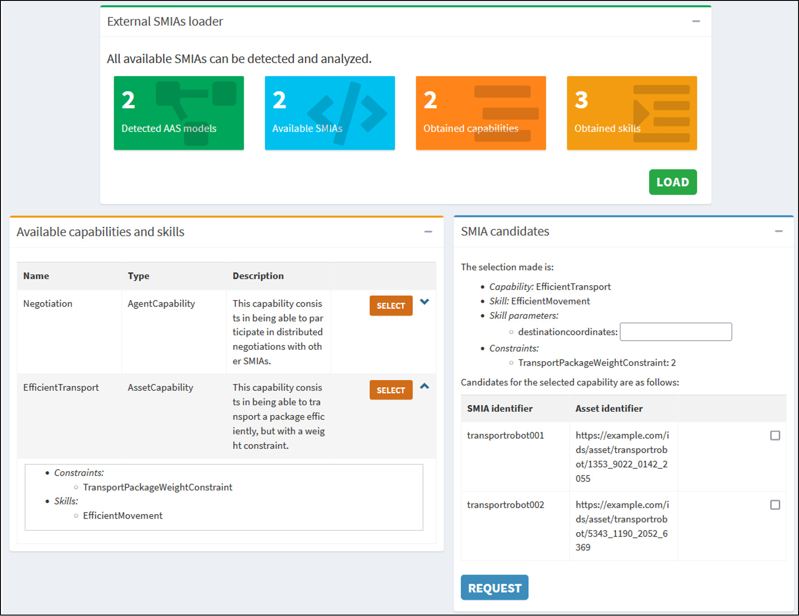
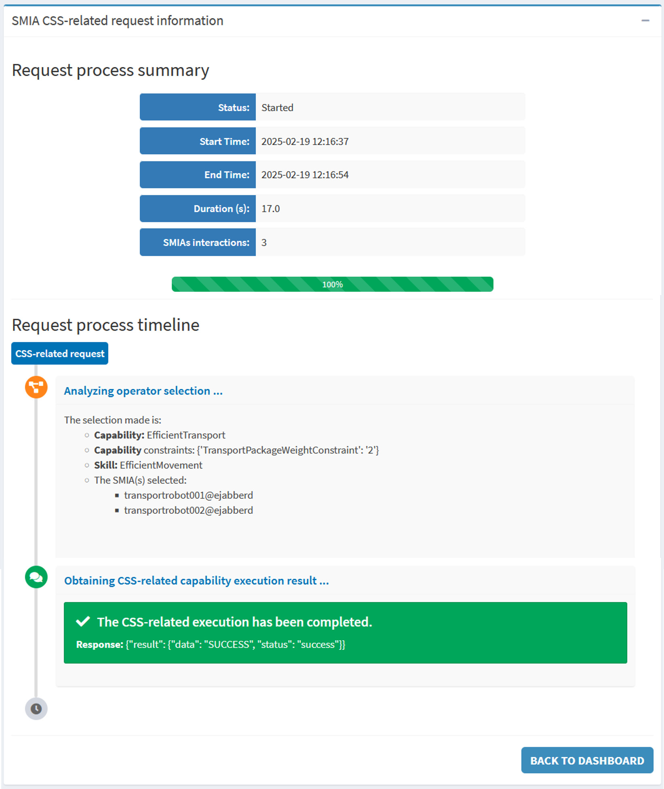

.. _SMIA ecosystem SMIA Operator:

SMIA ecosystem: SMIA Operator
=============================

The SMIA Operator is a specialized tool that features a graphical interface allowing human users to easily interact with deployed agents. This tool provides a structured view of the functional information (:term:`CSS model`) of the assets and enables users to request tasks from associated SMIA agents without having to deal with the complexity of the required I4.0 Language (FIPA-SMIACL).

.. note::

    The SMIA Operator software has been used in the :octicon:`repo;1em` :ref:`Use case transport logistics <Use case transport logistics>`, which has an associated visual resource available on :octicon:`video;1em` `Youtube <https://www.youtube.com/watch?v=Cs465Z1FeSA&list=PLs6bFF_iqW3HEwYAFOMHvW0xEngXnVF9K>`_.

Source Code Reference
---------------------

The SMIA Operator represents a human worker and acts as a Digital Twin (DT). Its Graphical User Interface (GUI) has been developed using native web interface functionalities of SPADE.

The source code can be downloaded directly from the official GitHub repository for manually provisioned environments.

.. dropdown:: Link to SMIA Operator source code
       :octicon:`link;1em;sd-text-primary`

       .. button-link:: https://github.com/ekhurtado/SMIA/tree/main/additional_tools/extended_agents/smia_operator_agent
            :color: primary
            :outline:

            :octicon:`mark-github;1em` SMIA Operator agent source code

.. seealso::

    The API documentation for the SMIA Operator source code is also available at :octicon:`repo;1em` :ref:`API documentation SMIA ecosystem <API documentation SMIA ecosystem>`.

Deployment Environment
----------------------

The first step is the establishment of an appropriate deployment environment. A valid environment containing SMIA Operator can be easily generated using the tool provided in this documentation platform: :ref:`SMIA Environment Builder`: in step 3, *SMIA Operator* must be selected. There are two primary types of environments for the SMIA Operator.

Local deployment
~~~~~~~~~~~~~~~~

In a local environment, SMIA instances are executed locally.

#. Download the tool from the provided GitHub link.
#. Configure the ``smia_operator_starter.py`` script. The JID must be configured to connect to the same XMPP server to enable agent communication.
#. Specify the path for the ``SMIA_Operator_article.aasx`` model within the starter script. Verify that the model is located in ``smia_archive/config/aas``.
#. Execute the Python launcher script.

Virtualized deployment
~~~~~~~~~~~~~~~~~~~~~~

For virtualized environments, Docker Compose or Kubernetes can be used. The SMIA Operator requires a specific Docker image built upon the core provided by SMIA. This image is available in the `SMIA Docker Hub <https://hub.docker.com/r/ekhurtado/smia-tools/tags>`_.

When deploying via Docker Compose, centralize the container and service definitions within a ``docker-compose.yml`` file.

- The JID configuration is managed via the ``AGENT_ID`` and ``AGENT_PSSWD`` environment variables.
- Verify that the ``SMIA_Operator_article.aasx`` model is located in the ``aas/`` directory.

Execution is triggered by invoking the following command within the directory containing the YAML file and the ``aas/`` folder:

.. code:: bash

    docker compose up

If using a Kubernetes cluster, assuming the required YAML files are located in a ``deploy/`` folder, execute the following command:

.. code:: bash

    kubectl apply -f deploy/

Once deployed, each container initiates its lifecycle by autonomously self-configuring according to its corresponding AAS model.

Using the SMIA Operator
-----------------------

Following the successful instantiation of the SMIA agents, their performance and behavior can be validated. The SMIA Operator autonomously orchestrates the underlying FIPA-SMIACL interactions.

Dashboard layout
~~~~~~~~~~~~~~~~

The SMIA Operator dashboard is divided into three main sections, each related to a different phase of the interaction process:

* ``External SMIAs loader`` section: this section offers the possibility to discover the SMIAs available within the deployment environment and to clearly display the information extracted from their analysis. For each SMIA identified, its associated AAS model is analyzed to obtain all its CSS elements (capabilities, skills, constraints, properties).
* ``Available capabilities and skills`` section: this section shows a table with all the CSS model information obtained from the analysis of the available SMIAs, organized by identified capabilities. It offers the possibility to select one of them.
* ``SMIA candidates`` section: this section lists the SMIA instances that match the selected capability and its constraints. It allows the user to decide which specific agent (or group of agents for negotiation) should execute the request.

.. _fig:smia-operator-dashboard:

    SMIA Operator dashboard

Accessing the GUI
~~~~~~~~~~~~~~~~~

To access the SMIA Operator control panel, open a web browser and navigate to the interface (see :numref:`fig:smia-operator-dashboard`):

.. code:: bash

    http://localhost:10000/smia_operator

.. note::

    In virtualized environments, the IP address should be changed to that of the container. It should also be verified whether the container's exposed port matches or if a different one has been defined.

Execution Workflow
~~~~~~~~~~~~~~~~~~

The user interface is deliberately designed to abstract underlying technical details and prioritize operational simplicity. The interaction follows a clear operational workflow:

#. **Load CSS Information:** At the top of the GUI, use the :bdg-success:`LOAD` button to execute an automatic search and analysis of available SMIA agents. The GUI will be updated and all the information obtained will appear in the capabilities and skills table with the detected CSS elements.
#. **Select Capability:** Target a specific capability using the :bdg-warning:`SELECT` button in the corresponding table row. If any extra data needs to be added (e.g., skill selection or constraint values), the system interactively prompts for them. The SMIA candidates table is then updated with compatible assets.
#. **Request Execution:** In the SMIA candidates table, decide which agent (a specific one or several to negotiate) should perform the capability, and use the :bdg-primary:`REQUEST` button to trigger execution.

   - If a single SMIA instance is selected, it directly executes the capability.
   - If multiple agents are selected, they initiate an autonomous distributed negotiation protocol (via FIPA-SMIACL) to determine the most suitable agent for the task.
   - If the selected skill has input parameters, their values must be provided before the request can be made.

Execution results
~~~~~~~~~~~~~~~~~

When the capability has been requested, the necessary interactions with the selected SMIAs are performed. Once the full request process is completed, the execution information is displayed on a new page (see :numref:`fig:smia-operator-results`). This page is divided into two sections:

* General information on the capability execution request.
* A timeline with information on each step performed by the SMIA Operator, including interpretation steps and negotiation between agents.

This representation brings traceability and operational transparency to the distributed industrial environment.

.. _fig:smia-operator-results:

    SMIA Operator execution results page