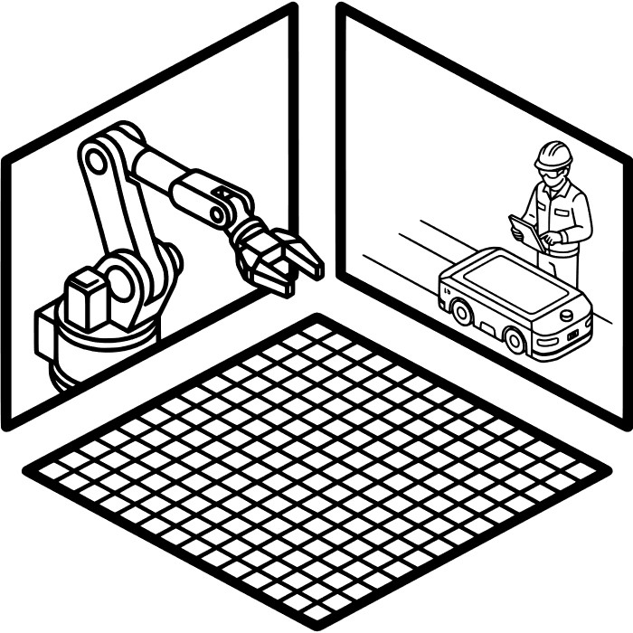

.. _SMIA ecosystem Assets Simulators:

SMIA ecosystem: Assets Simulators
=================================

Asset Simulators are testing and validation infrastructure components designed for the SMIA ecosystem. These simulators provide mock endpoints and environments representing physical and human assets (such as production robots, mobile robots, and human operators) to enable local testing, verification, and validation of SMIA agents functionality without requiring physical hardware. They expose physical capabilities and states, allowing agents to interact with virtual assets in a homogeneous manner, ensuring robust and reliable testing of the ecosystem.

HTTP Asset Simulator
--------------------

The Assets Simulator HTTP provides simulated endpoints for production robots, mobile robots, and human operators, exposing their physical capabilities (functionalities) and states (e.g., battery, stamina, status) via REST APIs.

.. note::

    The Assets Simulator HTTP includes enhanced User Experience (UX) features in its web interface and dynamic SVG animations representing the simulated assets (such as the specific transport animation displaying a carried object).

Source Code Reference
~~~~~~~~~~~~~~~~~~~~~

The Assets Simulator HTTP is built using Python with the FastAPI framework. It provides both a backend API and a modern web-based UI to monitor and interact with the simulated assets in real-time.

.. dropdown:: Link to Assets Simulator HTTP source code
       :octicon:`link;1em;sd-text-primary`

       .. button-link:: https://github.com/ekhurtado/SMIA/tree/main/additional_tools/assets_simulators/assets_simulator_http
            :color: primary
            :outline:

            :octicon:`mark-github;1em` Assets Simulator HTTP source code

Deployment Environment
~~~~~~~~~~~~~~~~~~~~~~

The Assets Simulator HTTP can be deployed by configuring environment variables that define the identifiers for different types of simulated assets to instantiate:

- ``PRODUCTION_ASSETS``: Comma-separated list of production robot identifiers.
- ``MOBILE_ASSETS``: Comma-separated list of mobile robot identifiers.
- ``HUMAN_ASSETS``: Comma-separated list of human operator identifiers.

The server listens on port ``5000`` and can be started locally via the main Python script (``python main.py``).

Automated deployment
^^^^^^^^^^^^^^^^^^^^

A valid virtualized environment containing the HTTP Asset Simulator can be easily generated using the tool provided in this documentation platform: :octicon:`repo;1em` :ref:`SMIA Environment Builder`. To achieve the desired result, in step 3 the simulator must be selected along with the assets, and the specific identifiers for each asset type must be defined.

Alternatively, a ready-to-deploy environment is available in the SMIA repository. It includes valid CSS-enriched AAS models (located inside the ``/aas`` folder) and can be easily launched using Docker Compose (``docker compose up``).

.. dropdown:: Link to ready-to-deploy simulated environment
       :octicon:`link;1em;sd-text-primary`

       .. button-link:: https://github.com/ekhurtado/SMIA/tree/main/use_cases/simulated_assets_cases/simulated_assets_http
            :color: primary
            :outline:

            :octicon:`mark-github;1em` Simulated HTTP Assets Environment

Interface and Interaction
~~~~~~~~~~~~~~~~~~~~~~~~~

The Assets Simulator HTTP exposes a set of HTTP/REST APIs for programmatic control, as well as a Server-Sent Events (SSE) stream for real-time state synchronization with its web user interface.

It supports three categories of assets, each possessing a specific set of operational capabilities (tasks):

- **Robot (production)**: ``weld``, ``drill``, ``pick_place``
- **Mobile**: ``transport``, ``patrol``, ``scan``
- **Human**: ``transport``, ``assemble``, ``inspect``, ``maintain``

The system simulates energy consumption for machine assets (battery) and fatigue for human workers (stamina), running in a continuous background loop. These can also be replenished through ``charging`` (battery) and ``recovery`` (stamina).

API overview
^^^^^^^^^^^^

=======================  ======================================================
**Base URL**             ``http://<Simulator IP>:5000/api/v1``
**Content Type**         ``application/json``
**Web UI**               ``http://<Simulator IP>:5000/``
=======================  ======================================================

The primary interaction with assets is done through the base endpoint:
``/asset/{asset_id}``

This endpoint groups the three main operations for each asset: status retrieval, action execution, and energy/stamina recovery.

API reference
^^^^^^^^^^^^^

.. dropdown:: :octicon:`cache;1em;sd-text-primary` Asset Status API

    Provides endpoints for retrieving real-time telemetry from a specific asset. Telemetry data varies slightly based on the asset type (e.g., humans return ``stamina`` instead of ``battery``).

    .. list-table::
       :header-rows: 1
       :widths: 28 8 22 42

       * - Path
         - Method
         - Description
         - Parameters
       * - ``/asset/{asset_id}/status``
         - :bdg-success:`GET`
         - Returns the current status of an asset
         - *Path:* ``asset_id``

    **Example Request:**

    .. code-block:: bash

        curl -X GET "http://localhost:5000/api/v1/asset/robot_01/status"

.. dropdown:: :octicon:`cache;1em;sd-text-primary` Asset Action API

    Provides endpoints for requesting the execution of physical capabilities. Actions consume battery or stamina based on the specified duration.

    .. list-table::
       :header-rows: 1
       :widths: 28 10 20 42

       * - Path
         - Method
         - Description
         - Parameters
       * - ``/asset/{asset_id}/action/{action_name}``
         - :bdg-warning:`POST`
         - Triggers a specific action on the asset
         - *Path:* ``asset_id``, ``action_name``; *Body:* ``ActionRequest``

    **Body API schema:**

    .. list-table:: ActionRequest
       :header-rows: 1
       :widths: 20 15 10 55

       * - Field
         - Type
         - Req.
         - Description
       * - ``duration``
         - ``integer``
         - Yes
         - Duration of the action in seconds (Must be greater than 0 and up to 30)

    **Example Request:**

    .. code-block:: bash

        curl -X POST "http://localhost:5000/api/v1/asset/mobile_01/action/transport" \
             -H "Content-Type: application/json" \
             -d '{
               "duration": 5
             }'

.. dropdown:: :octicon:`cache;1em;sd-text-primary` Asset Recovery API

    Provides endpoints for managing energy and stamina recovery cycles. Assets must be in an ``idle`` state to begin recovery.

    .. list-table::
       :header-rows: 1
       :widths: 28 10 20 42

       * - Path
         - Method
         - Description
         - Parameters
       * - ``/asset/{asset_id}/charge``
         - :bdg-warning:`POST`
         - Toggles charging for robotic assets
         - *Path:* ``asset_id``; *Body:* ``ChargeRequest``
       * - ``/asset/{asset_id}/recover``
         - :bdg-warning:`POST`
         - Toggles stamina recovery for human assets
         - *Path:* ``asset_id``; *Body:* ``ChargeRequest``

    **Body API schema:**

    .. list-table:: ChargeRequest
       :header-rows: 1
       :widths: 20 15 10 55

       * - Field
         - Type
         - Req.
         - Description
       * - ``enable``
         - ``boolean``
         - No
         - Activates (``true``) or deactivates (``false``) the recovery/charge cycle

    **Example Request:**

    .. code-block:: bash

        curl -X POST "http://localhost:5000/api/v1/asset/human_01/recover" \
             -H "Content-Type: application/json" \
             -d '{
               "enable": true
             }'

