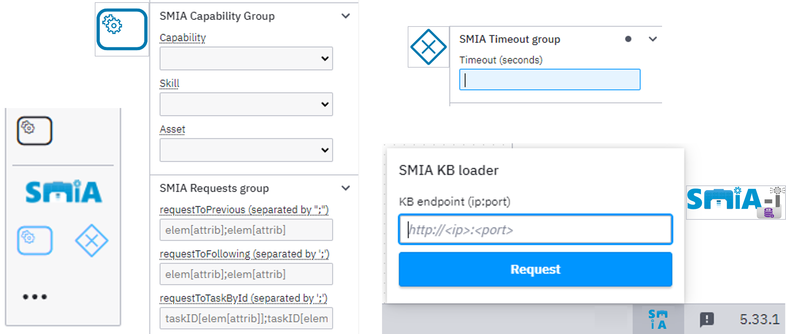

.. _SMIA ecosystem Camunda Modeler:

SMIA ecosystem: Camunda Modeler
===============================

To facilitate the design and development of flexible manufacturing plans, the leading BPMN tool Camunda Modeler is proposed as the visual editor. A dedicated plugin has been developed to simplify and facilitate the definition of valid CSS-driven BPMN workflows for the SMIA approach, particularly for their automated execution by :term:`SMIA PE`.

The objective is to achieve manufacturing modularization through the :term:`CSS model` by extending standard BPMN workflows with the necessary functional information within flexible production plans.

.. important::

    To reduce complexity, it is highly recommended to use this editor to graphically design the plan, rather than manually modifying the BPMN definition files.

Setting up the software
-----------------------

To generate CSS-driven BPMN workflows, the Camunda Modeler tool must be configured and set up.

    The Camunda Modeler tool is available in its `official GitHub repository <https://github.com/camunda/camunda-modeler/>`_ or can be downloaded from the `official website <https://camunda.com/download/modeler/>`_.  It is licensed under the MIT License and is available for various operating systems (Windows, Linux, macOS).

.. tip::

    If you install the software from its `official website <https://camunda.com/download/modeler/>`_, simply unzip the compressed file and run the main executable (e.g., ``Camunda Modeler.exe`` for Windows).

Once downloaded, you must add the SMIA plugin to your installation. To do so, follow these steps:

#. Download the plugin files, available on GitHub as an additional tool <https://github.com/ekhurtado/SMIA/tree/main/additional_tools/camunda_smia_plugin>.
#. Add the files to the Camunda Modeler installation folder.
    * Locate the Camunda Modeler installation folder (where the compressed file was unzipped)
    * Copy the plugin files downloaded from GitHub *camunda_smia_plugin* to ``<Camunda Modeler folder>/resources/plugins/``

.. dropdown:: :octicon:`info;1em;sd-text-primary` Information about compiling the plugin in case of an incomplete configuration.

    .. note::

        The plugins must be added in the location where the Camunda Modeler software has been installed. First, if you do not have all the dependencies installed, you can install them with the following command (you can open cmd for this in the location of the 'src' folder of the plugin source code):

        .. code-block:: bash

            npm install

        To use the plugin, you may need to compile it so that the "dist" and "node_modules" folders are generated. In the case of this plugin, "all" is used to compile everything, so to compile the plugin you have to execute the following command:

        .. code-block:: bash

            npm run all

        Either compiled earlier and copied to the Camunda installation folder or copied to the folder and then compiled, once the plugin is inside the Camunda installation folder it can be used. If there are problems, Camunda should be restarted. There are two options: close and open the program, or execute Ctrl+R.

SMIA plugin for Camunda Modeler
-------------------------------

A key aspect of the proposed SMIA approach is digitizing manufacturing plans represented as production assets, ensuring flexibility throughout the design and execution phases. The plan definition must contain the sequence of actions for both manufacturing and contingency situations.

This is achieved through a BPMN-based design, together with the asset description based on CSS-enriched :term:`AAS` models. However, to operationalize this process, specific elements of the BPMN standard are semantically enriched:

* **Manufacturing Services:** The BPMN *ServiceTask* element has been identified as the one that best represents manufacturing services.
* **Events and Contingencies:** The BPMN *ExclusiveGateway* element manages the flow based on conditions, enabling the definition of undesirable situations and their corresponding contingency tasks.

BPMN Extension for the SMIA Approach
~~~~~~~~~~~~~~~~~~~~~~~~~~~~~~~~~~~~

To minimally modify standard elements and maintain compatibility within the BPMN ecosystem, an extension is performed by specifying additional attributes. The added CSS information characterizes the execution of a manufacturing asset's task.

.. dropdown:: :octicon:`file-badge;1em;sd-text-primary` BPMN extension within SMIA approach for ``Service Task`` element.

    .. list-table::
       :widths: 25 15 40
       :header-rows: 1
       :align: center

       * - Attribute
         - Type
         - Description
       * - ``smia:capability``
         - ``IRI``
         - Ontology IRI of the capability.
       * - ``smia:constraints``
         - ``IRI=*;``
         - List of restrictions with data along with related IRIs.
       * - ``smia:skill``
         - ``IRI``
         - Ontology IRI of the skill.
       * - ``smia:skillParameters``
         - ``IRI=*;``
         - List of parameters with data along with related IRIs.
       * - ``smia:asset``
         - ``String``
         - Identifier of the asset.
       * - ``smia:requestToPrevious`` / ``smia:requestToFollowing``
         - ``CSStype[IRI];``
         - List of CSS elements to be obtained from the previous/following task in the flow.
       * - ``smia:requestToTaskById``
         - ``TaskID[CSStype[IRI]];``
         - List of CSS elements to be obtained from the task specified by its identifier.

.. dropdown:: :octicon:`file-badge;1em;sd-text-primary` BPMN extension within SMIA approach for ``Exclusive Gateway`` element.

    .. list-table::
       :widths: 25 15 100
       :header-rows: 1
       :align: center

       * - Attribute
         - Type
         - Description
       * - ``smia:timeoutValue``
         - ``Integer``
         - Timeout for the previous task execution.

The defined structures for the values of each attribute allow for data validation, facilitating its subsequent extraction at runtime.

.. tip::

    As the plan design is modular, it is not mandatory to establish all assets beforehand. Regarding the realization of the task, it is possible to either select a specific asset or leave it undefined so that the most suitable asset is dynamically chosen at runtime.

.. TODO SE HA ANALIZADO HASTA AQUI, QUEDA ACABAR LA PAGINA

Using the Camunda Modeler Plugin
--------------------------------

The dedicated Camunda Modeler plugin allows the integration of the proposed extension together with related functionalities, relying on the standardized structures (AAS) to obtain key design data.

.. _fig-camunda-modeler-plugin-smia:

    **Figure**: Extension of Camunda Modeler for the SMIA approach.

Designing the Workflow
~~~~~~~~~~~~~~~~~~~~~~

The design process using the plugin involves the following automated and manual steps:

#. **Extract standardized asset information:** By configuring the location of the SMIA-I KB, the plugin connects to the AAS repository and extracts all available CSS-related information via its HTTP-based OpenAPI interface.
#. **Design the production plan:** The BPMN element palette is extended with customized *ServiceTask* and *ExclusiveGateway* elements. These contain intuitive forms-based editing interfaces exposing the functional information to the designer.
#. **Map CSS data references:** The designer explicitly maps CSS information to data references (e.g., capability, skill, and skill parameters). Modularization requirements (capability constraints) or implementation configurations can also be defined.
#. **Define abnormal situations:** Utilizing *ExclusiveGateway* elements, the designer establishes branches for different sequences of actions. If an event occurs (such as a timeout mechanism for the completion of a previous task), the associated branch establishes recovery tasks to manage the contingency.

Generating the CSS-enriched AAS model
-------------------------------------

Once the design-related tasks are completed through graphical modeling, the valid BPMN file is generated. This file serves as the selected machine-readable format.

However, to formalize these workflows as digitizable manufacturing assets, the plan definition must be included as part of the CSS-enriched AAS model description.

This process does not require specific development and can be performed using the :ref:`AASX Package Explorer` tool. The BPMN file is easily embedded within the AASX package as a supplemental file.

Finally, the resulting CSS-enriched AAS model is stored in the AAS Repository, making it accessible for the operational phase.

----

**This page isn't fully developed yet, but it will be soon!**

.. TODO DESARROLLAR ESTA PAGINA Y QUITAR LA ANTERIOR FRASE

