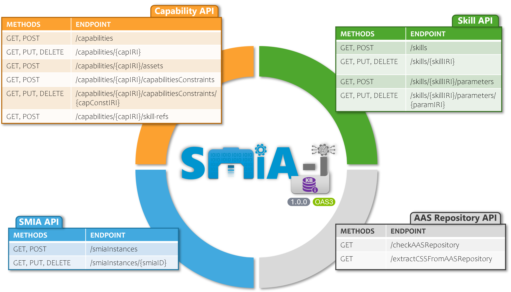

.. _SMIA ecosystem SMIA-I KB:

SMIA ecosystem: SMIA-I KB
==========================

SMIA-I KB (Knowledge Base) provides system information to identify SMIA agents and their CSS functional information for dynamic scenarios. This Knowledge Base offers identifying manufacturing capabilities and associated SMIA instances. The suffix "-I" denotes its function as a support infrastructure component for SMIA instances but not an agent itself, offering complete decoupling.

.. note::

    SMIA-I KB has been used in the :octicon:`repo;1em` :ref:`Flexible small-scale manufacturing <Use case flexible small-scale manufacturing>`, which has an associated visual resource available on :octicon:`video;1em` `Youtube <https://www.youtube.com/watch?v=f5_2QddHT5g&list=PLs6bFF_iqW3HEwYAFOMHvW0xEngXnVF9K>`_.

Source Code Reference
---------------------

The SMIA-I KB leverages an OWL ontological database, enabling efficient management of CSS-related information. Developed in Python, it leverages *OWLready2*, the same ontology library as SMIA. To ensure consistency in its connectivity with the external infrastructure, a homogeneous interaction pattern based on the OpenAPI specification is used.

.. dropdown:: Link to SMIA-I KB source code
       :octicon:`link;1em;sd-text-primary`

       .. button-link:: https://github.com/ekhurtado/SMIA/tree/main/additional_tools/infrastructure_components/smia_i_kb
            :color: primary
            :outline:

            :octicon:`mark-github;1em` SMIA-I KB source code

.. .. seealso::

    .. The API documentation for the SMIA ecosystem source code is also available at :octicon:`repo;1em` :ref:`API documentation SMIA ecosystem <API documentation SMIA ecosystem>`.

Interface and Interaction
-------------------------

The SMIA-I KB exposes a homogeneous and standardized HTTP/REST API following the OpenAPI 3.0.4 specification, built on top of *Flask* Python package. This API provides full programmatic control over the Capability-Skill-Service (CSS) model Knowledge Base, enabling SMIA agents and external manufacturing applications to query capabilities, manage skill parameters, and discover registered SMIA agent instances. All ontology resources (capabilities, skills, constraints, SMIA instances, etc.) are managed through this API, which acts as the exclusive interaction gateway for external components such as SMIA agents (mediated by SMIA ISM) and the AAS Repository.

.. note::

    The SMIA-I KB server listens on port ``8080`` and exposes the API at the base path ``/api/v3``. It is recommended to containerize it, since it is available as a Docker image under ``ekhurtado/smia-tools:latest-smia-kb``.

API overview
~~~~~~~~~~~~

=======================  ======================================================
**Base URL**             ``https://<SMIA-I KB IP>:<SMIA-I KB PORT>/api/v3``
**Content Type**         ``application/json`` (``application/xml`` also
                         supported)
**Specification**        OpenAPI 3.0.4
**Identifier Encoding**  Ontology IRIs must be Base64-URL-encoded when used
                         as path parameters. The Serialization API provides
                         encode/decode utilities for this purpose.
=======================  ======================================================

.. tip::

    SMIA-I KB also offers a web-based graphical interface accessible via the path ``/api/v3/ui/``. It provides detailed information on the complete API, as well as interactive utilities that allow users to send HTTP requests to each specific API and receive the response, along with examples to ensure that these requests comply with the specification.

API reference
~~~~~~~~~~~~~

.. _fig-smia-i-kb-api:

    **Figure**: SMIA-I KB interface

The API is organized into several functional areas corresponding to the CSS (Capability-Skill-Service) model and SMIA operative environment. The :ref:`fig-smia-i-kb-api` illustrates the main resource groups. The following list provides details on each of them.

.. note::

    The ``Serialization API`` is not shown in the figure because it does not interact with the internal database. It provides useful endpoints for users working with AAS and OWL identifiers (*capabilityIdentifier*, *skillIdentifier*), since the OpenAPI specification requires Base64-URL-encoded parameters. The Serialization API provides encode/decode utilities for this purpose.

.. dropdown:: :octicon:`cache;1em;sd-text-primary` Capability API

    This API manages the Capability layer of the CSS model, providing endpoints for creating, reading, updating, and deleting **Capabilities** and their related elements (constraints, skill references, assets).

    .. list-table::
       :header-rows: 1
       :widths: 20 8 22 40

       * - Path
         - Method
         - Description
         - Parameters
       * - ``/capabilities``
         - :bdg-success:`GET`
         - Returns all capabilities
         -
       * -
         - :bdg-warning:`POST`
         - Add a new capability
         - *Body:* ``Capability`` (:ref:`REF <SMIA ecosystem SMIA-I KB API schemas>`)

       * -
         -
         -
         -
       * - ``/capabilities/$identifiers``
         - :bdg-success:`GET`
         - Returns all capability IRI identifiers
         -

       * -
         -
         -
         -
       * - ``/capabilities/{capabilityIdentifier}``
         - :bdg-success:`GET`
         - Returns a specific capability
         - *Path:* ``capabilityIdentifier`` (Base64)
       * -
         - :bdg-warning:`PUT`
         - Updates an existing capability
         - *Path:* ``capabilityIdentifier``; *Body:* ``Capability``
       * -
         - :bdg-danger:`DELETE`
         - Deletes a specific capability
         - *Path:* ``capabilityIdentifier``

       * -
         -
         -
         -
       * - ``/capabilities/{capabilityIdentifier}/skill-refs``
         - :bdg-success:`GET`
         - Returns skill references of a capability
         - *Path:* ``capabilityIdentifier``
       * -
         - :bdg-warning:`POST`
         - Add a skill reference to a capability
         - *Path:* ``capabilityIdentifier``; *Body:* ``ReferenceIRI``

       * -
         -
         -
         -
       * - ``/capabilities/{capabilityIdentifier}/capabilitiesConstraints``
         - :bdg-success:`GET`
         - Returns constraints of a capability
         - *Path:* ``capabilityIdentifier``
       * -
         - :bdg-warning:`POST`
         - Add a constraint to a capability
         - *Path:* ``capabilityIdentifier``; *Body:* ``CapabilityConstraint``

       * -
         -
         -
         -
       * - ``/capabilities/{capabilityIdentifier}/capabilitiesConstraints/{capabilityConstraintIdentifier}``
         - :bdg-success:`GET`
         - Returns a specific constraint
         - *Path:* both identifiers (Base64-URL encoded)
       * -
         - :bdg-warning:`PUT`
         - Updates a constraint
         - *Path:* both identifiers; *Body:* ``CapabilityConstraint``
       * -
         - :bdg-danger:`DELETE`
         - Deletes a constraint
         - *Path:* both identifiers

       * -
         -
         -
         -
       * - ``/capabilities/{capabilityIdentifier}/assets``
         - :bdg-success:`GET`
         - Returns assets of a capability
         - *Path:* ``capabilityIdentifier``
       * -
         - :bdg-warning:`POST`
         - Add an asset to a capability
         - *Path:* ``capabilityIdentifier``; *Body:* plain string (asset ID)

.. dropdown:: :octicon:`cache;1em;sd-text-primary` Skill API

    This API manages the Skill layer of the CSS model, providing endpoints for creating, reading, updating, and deleting **Skills** and their associated parameters.

    .. list-table::
       :header-rows: 1
       :widths: 20 10 20 30

       * - Path
         - Method
         - Description
         - Parameters
       * - ``/skills``
         - :bdg-success:`GET`
         - Returns all skills
         -
       * -
         - :bdg-warning:`POST`
         - Add a new skill
         - *Body:* ``Skill``

       * -
         -
         -
         -
       * - ``/skills/$identifiers``
         - :bdg-success:`GET`
         - Returns all skill IRI identifiers
         -

       * -
         -
         -
         -
       * - ``/skills/{skillIdentifier}``
         - :bdg-success:`GET`
         - Returns a specific skill by IRI
         - *Path:* ``skillIdentifier`` (Base64-URL encoded)
       * -
         - :bdg-warning:`PUT`
         - Updates an existing skill
         - *Path:* ``skillIdentifier``; *Body:* ``Skill``
       * -
         - :bdg-danger:`DELETE`
         - Deletes a skill
         - *Path:* ``skillIdentifier``

       * -
         -
         -
         -
       * - ``/skills/{skillIdentifier}/parameters``
         - :bdg-success:`GET`
         - Returns parameters of a skill
         - *Path:* ``skillIdentifier``
       * -
         - :bdg-warning:`POST`
         - Add a parameter to a skill
         - *Path:* ``skillIdentifier``; *Body:* ``SkillParameter``

       * -
         -
         -
         -
       * - ``/skills/{skillIdentifier}/parameters/{skillParameterIdentifier}``
         - :bdg-success:`GET`
         - Returns a specific parameter
         - *Path:* both identifiers (Base64-URL encoded)
       * -
         - :bdg-warning:`PUT`
         - Updates a skill parameter
         - *Path:* both identifiers; *Body:* ``Skill``
       * -
         - :bdg-danger:`DELETE`
         - Deletes a skill parameter
         - *Path:* both identifiers

.. dropdown:: :octicon:`cache;1em;sd-text-primary` SMIA API

    This API manages deployed SMIA agent instances, providing endpoints for registering and querying **SMIA instances** that are part of the normalized manufacturing ecosystem.

    .. list-table::
       :header-rows: 1
       :widths: 20 10 20 30

       * - Path
         - Method
         - Description
         - Parameters
       * - ``/smiaInstances``
         - :bdg-success:`GET`
         - Returns all registered SMIA instances
         -
       * -
         - :bdg-warning:`POST`
         - Register a new SMIA instance
         - *Body:* ``SMIAinstance``

       * -
         -
         -
         -
       * - ``/smiaInstances/$identifiers``
         - :bdg-success:`GET`
         - Returns all SMIA instance identifiers
         -

       * -
         -
         -
         -
       * - ``/smiaInstances/{smiaInstanceIdentifier}``
         - :bdg-success:`GET`
         - Returns a specific SMIA instance
         - *Path:* ``smiaInstanceIdentifier``
       * -
         - :bdg-warning:`PUT`
         - Updates an existing SMIA instance
         - *Path:* ``smiaInstanceIdentifier``; *Body:* ``SMIAinstance``
       * -
         - :bdg-danger:`DELETE`
         - Deletes a SMIA instance
         - *Path:* ``smiaInstanceIdentifier``

.. dropdown:: :octicon:`cache;1em;sd-text-primary` AAS Repository API

    This API manages the interaction with an AAS server, providing endpoints for integrating with an **AAS Repository** to automatically extract CSS information into the Knowledge Base.

    .. list-table::
       :header-rows: 1
       :widths: 20 10 20 30

       * - Path
         - Method
         - Description
         - Parameters
       * - ``/checkAASRepository``
         - :bdg-success:`GET`
         - Checks availability of the AAS Repository
         - *Query:* ``AASRepositoryURL``

       * -
         -
         -
         -
       * - ``/extractCSSFromAASRepository``
         - :bdg-success:`GET`
         - Extracts CSS information from the AAS Repository
         - *Query:* ``AASRepositoryURL``

.. dropdown:: :octicon:`cache;1em;sd-text-primary` Serialization API

    Utility endpoints for encoding and decoding ontology IRIs in Base64-URL format. These are essential for constructing path parameters in the Capability and Skill API endpoints, which require encoded identifiers.

    .. list-table::
       :header-rows: 1
       :widths: 20 10 20 30

       * - Path
         - Method
         - Description
         - Parameters
       * - ``/serialization``
         - :bdg-warning:`PUT`
         - Encodes a plain string into Base64-URL format
         - *Body:* ``ReferenceIRI`` (plain string)

       * -
         -
         -
         -
       * - ``/deserialization``
         - :bdg-warning:`PUT`
         - Decodes a Base64-URL string back to plain text
         - *Body:* ``ReferenceIRIencoded``

API schemas
~~~~~~~~~~~

.. _SMIA ecosystem SMIA-I KB API schemas:

The following schemas define the data structures that are used in request bodies and responses across the API.

.. list-table:: Capability
   :header-rows: 1
   :widths: 20 15 10 55

   * - Field
     - Type
     - Req.
     - Description
   * - ``iri``
     - ``ReferenceIRI``
     - Yes
     - Unique ontology IRI identifier (e.g., ``http://name.org/css-smia#Capability01``)
   * - ``name``
     - ``string``
     - Yes
     - Name of the capability (e.g., ``capability01``)
   * - ``category``
     - ``enum``
     - Yes
     - ``AgentCapability`` or ``AssetCapability``
   * - ``hasLifecycle``
     - ``enum``
     - Yes
     - ``ASSURANCE``, ``OFFER``, or ``REQUIREMENT``
   * - ``isRealizedBy``
     - ``[ReferenceIRI]``
     - Yes
     - Skill IRIs that realize this capability
   * - ``assets``
     - ``[Asset]``
     - Yes
     - Assets that can perform this capability
   * - ``isRestrictedBy``
     - ``[CapabilityConstraint]``
     - No
     - Constraints that restrict this capability

.. list-table:: Skill
   :header-rows: 1
   :widths: 20 15 10 55

   * - Field
     - Type
     - Req.
     - Description
   * - ``iri``
     - ``ReferenceIRI``
     - Yes
     - Unique ontology IRI identifier
   * - ``name``
     - ``string``
     - Yes
     - Name of the skill (e.g., ``skill01``)
   * - ``accessibleThrough``
     - ``[ReferenceIRI]``
     - No
     - Skill interface IRIs through which the skill is accessible
   * - ``hasParameter``
     - ``[SkillParameter]``
     - No
     - Associated skill parameters
   * - ``hasImplementationType``
     - ``string``
     - No
     - Implementation type (e.g., ``OPERATION``, ``SPADE_BEHAVIOUR``)

.. list-table:: SMIAinstance
   :header-rows: 1
   :widths: 20 15 10 55

   * - Field
     - Type
     - Req.
     - Description
   * - ``id``
     - ``ReferenceSMIA``
     - Yes
     - SMIA instance identifier (e.g., ``agentInstance001``)
   * - ``asset``
     - ``Asset``
     - Yes
     - Associated asset information
   * - ``aasID``
     - ``ReferenceAAS``
     - Yes
     - AAS identifier of the instance
   * - ``status``
     - ``string``
     - No
     - Current status (e.g., ``Running``)
   * - ``startedTimeStamp``
     - ``integer``
     - No
     - Unix timestamp of when the instance started
   * - ``smiaVersion``
     - ``string``
     - No
     - SMIA software version (e.g., ``0.2.3``)

.. list-table:: Asset
   :header-rows: 1
   :widths: 20 15 10 55

   * - Field
     - Type
     - Req.
     - Description
   * - ``id``
     - ``string``
     - Yes
     - Asset identifier (e.g., ``http://example.com/ids/asset001``)
   * - ``kind``
     - ``enum``
     - Yes
     - ``Type``, ``Instance``, or ``NotApplicable``
   * - ``type``
     - ``ReferenceAAS``
     - No
     - AAS reference for the asset

.. list-table:: CapabilityConstraint
   :header-rows: 1
   :widths: 20 15 10 55

   * - Field
     - Type
     - Req.
     - Description
   * - ``iri``
     - ``ReferenceIRI``
     - Yes
     - Unique ontology IRI identifier
   * - ``name``
     - ``string``
     - Yes
     - Name of the constraint (e.g., ``capabilityConstraint01``)
   * - ``hasCondition``
     - ``enum``
     - Yes
     - ``INVARIANT``, ``PRECONDITION``, or ``POSTCONDITION``

.. list-table:: SkillParameter
   :header-rows: 1
   :widths: 20 15 10 55

   * - Field
     - Type
     - Req.
     - Description
   * - ``iri``
     - ``ReferenceIRI``
     - Yes
     - Unique ontology IRI identifier
   * - ``name``
     - ``string``
     - Yes
     - Name of the parameter (e.g., ``skillParameter01``)
   * - ``hasType``
     - ``enum``
     - Yes
     - ``INPUT``, ``OUTPUT``, or ``INOUTPUT``

-----

**This page isn't fully developed yet, but it will be soon!**

.. TODO DESARROLLAR ESTA PAGINA Y QUITAR LA ANTERIOR FRASE