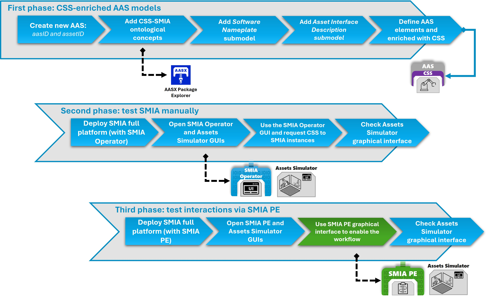
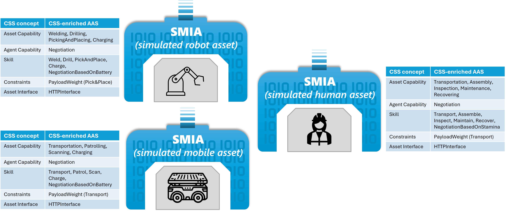

.. _Guided tutorial simulated assets:

Step-by-step tutorial: Simulated assets
=======================================

This document contains a step-by-step guide to building a SMIA agent and deploying it alongside the entire platform. An asset simulator is provided as part of the ecosystem infrastructure, enabling the evaluation of both the agent’s and the platform’s performance. It offers detailed steps to follow, as well as source code for specific parts, to successfully reproduce the development tutorial.

.. note::

    All resources for this tutorial are available in the official SMIA repository.

    .. button-link:: https://github.com/ekhurtado/SMIA/tree/main/examples/tutorials/SMIA_extension_simulated_assets
            :color: primary
            :outline:

            :octicon:`container;1em` Step-by-step tutorial GitHub resources

.. TODO HAY QUE AÑADIR LOS RECURSOS A GITHUB

Introduction
------------

Tutorial Description
~~~~~~~~~~~~~~~~~~~~

The tutorial consists of three phases. It starts by generating the necessary pre-configuration, such as the CSS-enriched AAS model for each SMIA instance. Next, the entire SMIA platform is deployed to evaluate all the instances associated with these CSS-enriched AAS models, thanks to the necessary infrastructure (in particular, SMIA Operator). Finally, it evaluates the autonomous interaction between SMIA instances by deploying and running a BPMN manufacturing plan executed by an SMIA PE agent. The three phases are illustrated in the following figure:

   **Figure**: SMIA simulated assets guided tutorial steps

The objective is to evaluate the CSS-enriched AAS models using simulated assets to test their performance. To do this, we will use the Assets Simulator, an infrastructure component of the SMIA ecosystem.

.. note::

    The guide for Asset Simulators is available at :octicon:`repo;1em` :ref:`SMIA ecosystem Assets Simulators`.

In this tutorial, we will use the HTTP-based simulator, which provides three types of assets, each with different capabilities:

The following figure shows the CSS-enriched AAS elements for the three types of assets provided by the HTTP asset simulator:

   **Figure**: SMIA simulated assets guided tutorial assets info

Tutorial Objective
~~~~~~~~~~~~~~~~~~

Upon completing this practice, you will have achieved the following:

1. **Model:** Create a CSS-enriched AAS model that defines the asset's capabilities and serves to enable the self-configuration of the SMIA agent. As part of this process, you will also learn how to define a valid asset interface.
2. **Individual validation:** Test and validate the operation of SMIA agents individually (the operation of each agent). The **SMIA Operator** agent will be used to make requests through an intuitive graphical interface (abstracting the underlying implementation using the I4.0 language).
3. **Collaborative validation:** Test and validate the operation of the SMIA agents as a set of asset representatives within the SMIA platform. The **SMIA PE** agent will be used to automate production plans as BPMN workflows and verify how the involved agents interact and collaborate.

Development Environment
~~~~~~~~~~~~~~~~~~~~~~~

Before starting the code development part of the tutorial, it is necessary to verify that all resources are ready:

1. **AASX Package Explorer:** Required for the development of the CSS-enriched AAS model. To achieve this, you can follow the `SMIA installation guide <https://smia.readthedocs.io/en/latest/smia_user_guide/installation_guide.html#aasx-package-explorer>`_.
2. **Docker Compose:**The deployment will be conducted using Docker Compose to obtain a self-contained environment with the entire SMIA platform. It can be downloaded from its `official website <https://docs.docker.com/compose/install/>`_.
3. **SMIA package:** If you want to develop extended code and create an extended agent. To achieve this, you can follow the `SMIA installation guide <https://smia.readthedocs.io/en/latest/smia_user_guide/installation_guide.html#smia-source-code>`_.
4. **Infrastructure:** The entire SMIA platform infrastructure will be deployed using Docker, so there is no need to install anything else. However, a web browser is required to access the graphical interfaces of the infrastructure components.

First Phase: Generate the CSS-enriched AAS model
------------------------------------------------

.. TODO

Second Phase: Develop the logic to extend SMIA
----------------------------------------------

.. TODO

Third Phase: Validate the extended SMIA using SMIA Operator
-----------------------------------------------------------

.. TODO