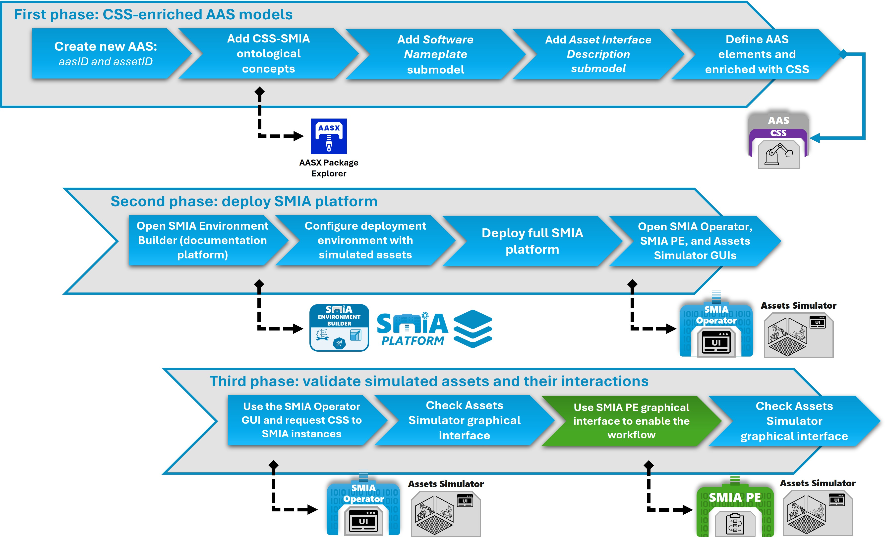
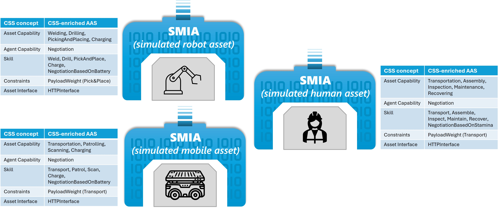
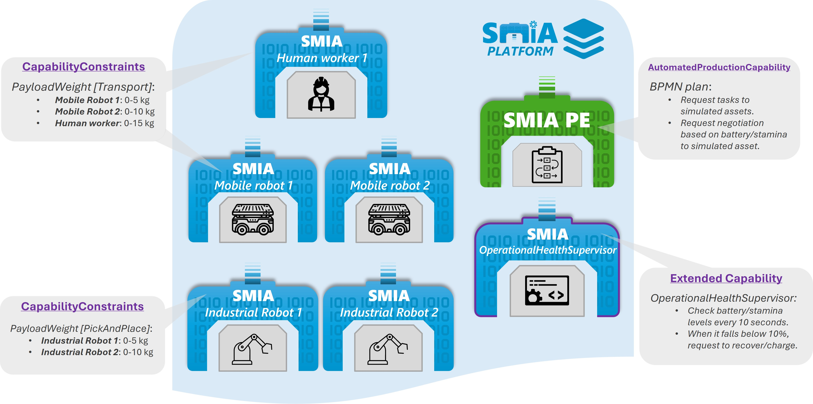
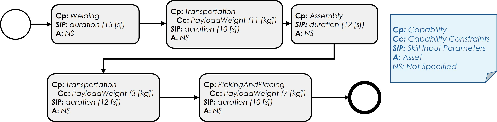

.. _Guided tutorial simulated assets:

Step-by-step tutorial: Simulated assets
=======================================

This document contains a step-by-step guide to building a SMIA agent and deploying it alongside the entire platform. An Assets Simulator is provided as part of the ecosystem infrastructure, enabling the evaluation of both the agent’s and the platform’s performance. It offers detailed steps to follow, as well as source code for specific parts, to successfully reproduce the development tutorial.

.. note::

    All resources for this tutorial are available in the official SMIA repository.

    .. button-link:: https://github.com/ekhurtado/SMIA/tree/main/examples/tutorials/SMIA_simulated_assets_guided_tutorial
            :color: primary
            :outline:

            :octicon:`mark-github;1em` Step-by-step tutorial GitHub resources

Introduction
------------

Tutorial Description
~~~~~~~~~~~~~~~~~~~~

The tutorial consists of three phases. It starts by generating the necessary pre-configuration, such as the CSS-enriched AAS model for each SMIA instance. Next, the entire SMIA platform is deployed to evaluate all the instances associated with these CSS-enriched AAS models and their collaborative interaction. This process is facilitated by the Environment Builder tool on this documentation platform. Finally, it evaluates the operation of the agents and the collaborative and autonomous interaction among the SMIA instances in two stages. To validate the individual operation of each agent, the SMIA Operator infrastructure service is leveraged. To validate the distributed interactions, a BPMN manufacturing plan is launched and executed by an SMIA PE agent. The three phases are illustrated in the following figure:

   **Figure**: SMIA simulated assets guided tutorial steps

The objective is to evaluate the CSS-enriched AAS models using simulated assets to test their performance. To do this, we will use the Assets Simulator, an infrastructure component of the SMIA ecosystem.

.. note::

    The guide for Asset Simulators is available at :octicon:`repo;1em` :ref:`SMIA ecosystem Assets Simulators`.

In this tutorial, we will use the HTTP-based simulator, which provides three types of assets, each with different capabilities. For this tutorial, the following figure shows the CSS-enriched AAS elements for the three types of assets provided by the HTTP Assets Simulator:

   **Figure**: SMIA simulated assets guided tutorial assets info

To evaluate not only negotiation-based asset selection, several simulated assets with different characteristics are defined. This also enables constraint-based asset selection. In addition to these simulated assets, two logical assets are deployed to evaluate this type as well. First, an SMIA PE agent is deployed to represent a manufacturing plan which involves the simulated assets. On the other hand, a proactive logical asset will be deployed that will analyze the health of the simulated assets and request their recovery or charging if they fall below an established threshold.

   **Figure**: All assets and associated SMIA agents for simulated assets guided tutorial

Tutorial Objective
~~~~~~~~~~~~~~~~~~

Upon completing this practice, you will have achieved the following:

1. **Model:** Create a CSS-enriched AAS model that defines the asset's capabilities and serves to enable the self-configuration of the SMIA agent. As part of this process, you will also learn how to define a valid asset interface.
2. **Deploy:** Deploy a self-contained execution environment with the entire SMIA platform, including agents for simulated assets, extended logical agents, SMIA PE agents, and the entire supporting infrastructure for them.
3. **Individual validation:** Test and validate the operation of SMIA agents individually (the operation of each agent). The **SMIA Operator** agent will be used to make requests through an intuitive graphical interface (abstracting the underlying implementation using the I4.0 language).
4. **Collaborative validation:** Test and validate the operation of the SMIA agents as a set of asset representatives within the SMIA platform. The **SMIA PE** agent will be used to automate production plans as BPMN workflows and verify how the involved agents interact and collaborate.

Development Environment
~~~~~~~~~~~~~~~~~~~~~~~

Before starting the code development part of the tutorial, it is necessary to verify that all resources are ready:

1. **AASX Package Explorer:** Required for the development of the CSS-enriched AAS model. To achieve this, you can follow the `SMIA installation guide <https://smia.readthedocs.io/en/latest/smia_user_guide/installation_guide.html#aasx-package-explorer>`_.
2. **Docker Compose:** The deployment will be conducted using Docker Compose to obtain a self-contained environment with the entire SMIA platform. It can be downloaded from its `official website <https://docs.docker.com/compose/install/>`_.
3. **SMIA package:** If you want to develop extended code and create an extended agent. To achieve this, you can follow the `SMIA installation guide <https://smia.readthedocs.io/en/latest/smia_user_guide/installation_guide.html#smia-source-code>`_.
4. **Infrastructure:** The entire SMIA platform infrastructure will be deployed using Docker, so there is no need to install anything else. However, a web browser is required to access the graphical interfaces of the infrastructure components.

First Phase: generate the CSS-enriched AAS model
------------------------------------------------

In the first phase, we will generate the CSS-enriched AAS model that will allow the SMIA agent to self-configure and obtain all information related to the simulated asset it will represent. This same process can be applied to the three types of simulated assets. The steps to follow to generate the model from scratch are as follows:

1. Open the **``AASX Package Explorer``** tool and configure it for edit mode (``Workspace > Edit``).

2. Create a new AAS within the environment and define its *idShort*. Also, add an identifier for the asset in *globalAssetId*, which will be used later to identify it as a simulated asset. It can be generated automatically, but it is recommended to add an identifier that represents the asset type (e.g., “assetID/humanWorker001”).

3. Add the ontological identifiers of the CSS model in the form of ``ConceptDescriptions``.

    3.1. Add the submodel with the ontological identifiers of the CSS model: ``Workspace > Create ... > New submodel from plugin > AasxPluginGenericForms | GCIS/SubmodelWithCapabilitySkillOntology``.

    3.2. From the submodel, generate the ConceptDescriptions with ontological identifiers of the CSS model: button ``Create <- SMEs (all)``. Within *ConceptDescriptions*, all elements will have been generated. The submodel can now be deleted (button ``Delete``), as well as its ConceptDescription (*SubmodelWithCapabilitySkillOntology*) so that it does not produce errors later (since it generates it with an empty id).

    .. note::
       As of v2025-03-25, ConceptDescriptions are generated via the ``SMEs (all)`` functionality, but this is not capable of generating all information from the plugin for the CSS model. If you do not wish to fill in all the remaining information (e.g., *shortName* of each concept), it is possible to obtain it from the base resource for the development of the CSS-enriched AAS model. To do this, you can open a new window of the ``AASX Package Explorer`` tool, open the file ``CSS_AAS_model_base.aasx`` offered in this tutorial's folder, select and copy all ConceptDescriptions using the ``Copy`` button, and ``Paste into`` in our AAS.

4. Add the submodel for defining the SMIA software: ``Workspace > Create ... > New submodel from plugin > AasxPluginGenericForms | Nameplate for Software in Manufacturing (IDTA) V1.0``.

    4.1. Delete the SubmodelElement ``SoftwareNameplateType`` and modify the ``SoftwareNameplateInstance``: remove all occurrences of *{0:00}*.

    4.2. Specify the agent identifier in ``SoftwareNameplateInstance/InstanceName[value]`` (the same one that will later be defined in the JID in the code, although in this case without the XMPP server, i.e., only the identifier before "@"), and the agent version in ``SoftwareNameplateInstance/InstalledVersion[value]`` (e.g., "1.0.0"). In addition to these mandatory data, the others are optional. You can add any data you wish to define the SMIA software in more depth (installed modules, OS on which it is deployed, etc.).

    .. note::
       If you do not want to modify the submodel, you can obtain a valid submodel with the following process: open a new window of the ``AASX Package Explorer`` tool, open the file ``CSS_AAS_model_base.aasx`` offered in this tutorial's folder, copy the "SoftwareNameplate" submodel using the ``Copy`` button, and in our AAS, ``Paste into``.

5. Add the submodel for defining the interface of the simulated asset that the SMIA agent will represent: ``Workspace > Create ... > New submodel from plugin > AasxPluginGenericForms | AssetInterfacesDescription (IDTA) V1.0``. Completely define the *SubmodelElementCollection* corresponding to the protocols supported by the asset.

    5.1. In this tutorial, we'll be using the HTTP-based Assets Simulator, so you can edit the HTTP *SubmodelElementCollection* ("InterfaceTemplateForHTTP") and rename it, for example, to ``SimulatedAssetHTTPInterface``.

    5.2. To test and validate the interface, the *EndpointMetadata/base* element will be modified with the the endpoint of the asset on the server representing the Assets Simulator. To this end, the URI will be constructed as *http://<serverIP>:<serverPort>/api/v1/<assetID>*. Since we will later deploy all components using Docker, the container name can be used; therefore, a valid endpoint using the asset ID from the previous example would be: ``http://smia-assets-simulator-http:5000/api/v1/asset/assetID/humanWorker001``.

    5.3. To test and validate asset properties, they will be added to *InteractionMetadata/properties/*. For each asset property, its *SubmodelElementCollection* must be added and specified.

    First, define its *idShort*, which is the asset’s property. The Assets Simulator provides general information about each asset via ``status``. Depending on the asset type, this includes ``battery`` (production and mobile robots) or ``stamina`` (humans). Next, define the value of its data point in *forms/href/* (for example, ``/status``).

    If you want to extract a specific piece of data from all the information returned by the asset, you can specify it in *dataQuery*. In this tutorial, the Assets Simulator returns a JSON object containing all the asset’s information from the ``/status`` data point. If you want to extract a specific piece of data, add the field where the data is located (``$.stamina`` or ``$.battery``) to *dataQuery*. This way, you can choose to retrieve all the information for further processing ("status"), or you can configure SMIA to automatically extract specific data (“stamina” or “battery”).

    5.4. To test and validate asset services, they will be added to *InteractionMetadata/actions/*. For each asset property, its *SubmodelElementCollection* must be added and specified.

    First, its *idShort* will be defined, which corresponds to the asset’s service. The Assets Simulator provides actions for each asset type and recovery/charging service (``recover/charge``). All of these are shown in the figure above (:ref:`SMIA simulated assets guided tutorial assets info`). It is also necessary to define the value of its data point in *forms/href/* using the format */action/<actionID>* (for example, ``/action/transport`` for the transport action for humans and mobile assets). In this case, it is a POST request, so it is necessary to ensure that the “Content-Type” is defined in *forms/htv_headers/*.

    .. dropdown:: :octicon:`table;1em;sd-text-primary` Simulated assets actions mappings

        The following table shows the relationship between the available actions of simulated assets and the corresponding datapoints (*/action/<actionID>* within Assets Simulator server).

        +------------------+------------------+------------------+
        | Asset type       | Action           | Datapoint        |
        +==================+==================+==================+
        | Production Asset | Welding          | ``/weld``        |
        |                  +------------------+------------------+
        |                  | Drilling         | ``/drill``       |
        |                  +------------------+------------------+
        |                  | Pick & Place     | ``/pick_place``  |
        +------------------+------------------+------------------+
        | Mobile Asset     | Transportation   | ``/transport``   |
        |                  +------------------+------------------+
        |                  | Patrol           | ``/patrol``      |
        |                  +------------------+------------------+
        |                  | RADAR Scan       | ``/scan``        |
        +------------------+------------------+------------------+
        | Human Asset      | Transportation   | ``/transport``   |
        |                  +------------------+------------------+
        |                  | Assembly         | ``/assemble``    |
        |                  +------------------+------------------+
        |                  | QA Inspection    | ``/inspect``     |
        |                  +------------------+------------------+
        |                  | Maintenance      | ``/maintain``    |
        +------------------+------------------+------------------+

        .. tip::
            All actions allow specifying a ``duration`` as a parameter within the body of the HTTP request, but it is not necessary to specify it within the AID submodel (it is specified at the Skill CSS level and is automatically handled by SMIA).

    .. tip::
       The submodel must be completely defined so that it does not produce errors during the SMIA startup. If you wish to modify a valid submodel, you can open a new window of the ``AASX Package Explorer`` tool, open the file ``CSS_AAS_model_base.aasx`` offered in this tutorial's folder, copy the "AssetInterfacesDescription" submodel using the ``Copy`` button, and in our AAS, ``Paste into``.

6. Define the submodels with the asset information. To do this, create the submodels in the AAS via ``Create new Submodel of kind Instance``. For this tutorial, we will define two submodels to distinguish the CSS-enriched elements of the asset (functional information) and the ontological relations between them: ``CSSElements`` and ``CSSInfo``.

    6.1. Define the submodel ``CSSElements``, adding the following SubmodelElementCollections (specified by the idShort): *Capabilities*, *Skills*,, and *Constraints*. Within each collection, SubmodelElements will be added so that they can be semantically enriched later. Within *Capabilities*, the asset’s capabilities will be added using Capability elements, with their *idShort* set to the corresponding capability (e.g., for human assets, ``Assembly`` or ``Recovering``), while within *Skills*, Operations will be added with the associated skills for those capabilities (e.g., for human assets, ``Assemble`` or ``Recover``).

    All actions except "Recover" have a possible input SkillParameter to determine the duration of the action. This can be defined using a Property with the idShort *duration*. Finally, within *Constraints*, you can add the only currently possible limitation using a Range with the idShort *PayloadWeight*, with a type “xs:float” and values (e.g., min: 0.0 and max: 5.0).

    6.2. Define the submodel ``CSSInfo``, adding the following RelationshipElements to link the CSS elements. Capabilities, Skills, Skill Parameters, Capability Constraints, and Skill Interfaces must be linked correctly. You can use any naming convention you wish for the idShort, but descriptive names are recommended, such as *RelCapSkill<>* to link capabilities and skills, *RelSkillSkillInterface<>* to link skills and their interfaces, and *RelCapConstraint<>* to link capabilities and their constraints. To link elements, add them to the ``first`` and ``second`` parameters  (use the ``Add existing`` button to select the elements).

7. Semantically enrich the SubmodelElements with the ontological concepts of the CSS model. To do this, in each created element, add the corresponding ``semanticID``.

    7.1. In each SubmodelElement to be enriched, create an empty semanticID (``Create w/ default!``), then ``Add existing`` and select the identifiers corresponding to each element from the ConceptDescriptions (e.g., "http://www.w3id.org/upv-ehu/gcis/css-smia#AssetCapability" for asset capabilities).

    7.2. In each RelationshipElement defined for each ontological relationship, add its semanticID following the procedure in step ``7.1``.

    7.3. Define the *Qualifiers* for capabilities, skills, and constraints. To do this, create an empty qualifier (``Create w/ default!``), then ``Add preset`` and select the associated qualifier from ``GCIS | CSS |``. For example, for capabilities, add the *hasLifecycle* qualifier with the value *ASSURANCE*; for skills, add *hasImplementationType* with the value *ASSURANCE*; or for skill parameters, add *hasType* with the value *INPUT*, among others.

.. dropdown:: :octicon:`table;1em;sd-text-primary` Simulated assets CSS information
    :name: SMIA assets CSS information

    The following table shows the CSS information of simulated assets, required for their the CSS-enriched AAS model.

    +------------------+---------------------+--------------------+-----------------------------+-------------------+------------------------------------------------+
    | Asset Type       | Capability          | Capability Type    | Skill                       | Skill Parameter   | Constraint                                     |
    +==================+=====================+====================+=============================+===================+================================================+
    | Production Asset | Welding             | Asset Capability   | Weld                        | duration          | \-                                             |
    |                  +---------------------+--------------------+-----------------------------+-------------------+------------------------------------------------+
    |                  | Drilling            | Asset Capability   | Drill                       | duration          | \-                                             |
    |                  +---------------------+--------------------+-----------------------------+-------------------+------------------------------------------------+
    |                  | PickingAndPlacing   | Asset Capability   | PickAndPlace                | duration          | PayloadWeight (*IR1 [0-5 kg] / IR2 [0-10 kg]*) |
    |                  +---------------------+--------------------+-----------------------------+-------------------+------------------------------------------------+
    |                  | Charging            | Asset Capability   | Charge                      | \-                | \-                                             |
    |                  +---------------------+--------------------+-----------------------------+-------------------+------------------------------------------------+
    |                  | Negotiation         | Agent Capability   | NegotiationBasedOnBattery   | NegotiationWinner | \-                                             |
    +------------------+---------------------+--------------------+-----------------------------+-------------------+------------------------------------------------+
    | Mobile Asset     | Transportation      | Asset Capability   | Transport                   | duration          | PayloadWeight (*MR1 [0-5 kg] / MR2 [0-10 kg]*) |
    |                  +---------------------+--------------------+-----------------------------+-------------------+------------------------------------------------+
    |                  | Patrolling          | Asset Capability   | Patrol                      | duration          | \-                                             |
    |                  +---------------------+--------------------+-----------------------------+-------------------+------------------------------------------------+
    |                  | Scanning            | Asset Capability   | Scan                        | duration          | \-                                             |
    |                  +---------------------+--------------------+-----------------------------+-------------------+------------------------------------------------+
    |                  | Charging            | Asset Capability   | Charge                      | \-                | \-                                             |
    |                  +---------------------+--------------------+-----------------------------+-------------------+------------------------------------------------+
    |                  | Negotiation         | Agent Capability   | NegotiationBasedOnBattery   | NegotiationWinner | \-                                             |
    +------------------+---------------------+--------------------+-----------------------------+-------------------+------------------------------------------------+
    | Human Asset      | Transportation      | Asset Capability   | Transport                   | duration          | PayloadWeight (*[0-15 kg]*)                    |
    |                  +---------------------+--------------------+-----------------------------+-------------------+------------------------------------------------+
    |                  | Assembly            | Asset Capability   | Assemble                    | duration          | \-                                             |
    |                  +---------------------+--------------------+-----------------------------+-------------------+------------------------------------------------+
    |                  | Inspection          | Asset Capability   | Inspect                     | duration          | \-                                             |
    |                  +---------------------+--------------------+-----------------------------+-------------------+------------------------------------------------+
    |                  | Maintenance         | Asset Capability   | Maintain                    | duration          | \-                                             |
    |                  +---------------------+--------------------+-----------------------------+-------------------+------------------------------------------------+
    |                  | Recovering          | Asset Capability   | Recover                     | \-                | \-                                             |
    |                  +---------------------+--------------------+-----------------------------+-------------------+------------------------------------------------+
    |                  | Negotiation         | Agent Capability   | NegotiationBasedOnStamina   | NegotiationWinner | \-                                             |
    +------------------+---------------------+--------------------+-----------------------------+-------------------+------------------------------------------------+

8. Save the AASX file with the complete definition of the valid CSS-enriched AAS model. To do this, use the menu: ``File > Save as ...``, select the folder where the CSS-enriched AAS model will be saved and specify the name for the AASX file.

Second Phase: deploy SMIA platform
----------------------------------

Once the phase required for SMIA's self-configuration (development of CSS-enriched AAS models for the simulated assets) is complete, its associated agents will be deployed alongside the rest of the SMIA platform to validate their operation.

.. tip::
    In this tutorial, the platform will be deployed in a self-contained virtualized environment using Docker Compose, taking advantage of the fact that all platform components are available as images on Docker Hub (`SMIA agent image <https://hub.docker.com/r/ekhurtado/smia/tags>`_ and `platform component images <https://hub.docker.com/r/ekhurtado/smia-tools/tags>`_).

    You can use the CSS-enriched AAS models for the simulated assets (human, mobile, and production) developed in the previous phase. The rest of the CSS-enriched AAS model files for the logical assets (SMIA PE and proactive analysis asset) and infrastructure assets (SMIA Operator or SMIA ISM) are available in the :octicon:`mark-github;1em` `GitHub resources of this tutorial <https://github.com/ekhurtado/SMIA/tree/main/examples/tutorials/SMIA_simulated_assets_guided_tutorial>`_.

To safely and easily set up a valid deployment environment, we will use the tool provided in this documentation platform: :octicon:`repo;1em` :ref:`SMIA Environment Builder`. The steps to follow to generate the appropriate deployment environment from scratch are as follows:

1. Open :octicon:`repo;1em` :ref:`SMIA Environment Builder` and click ``Start configuration``.
2. In *Step 1*, select the ``Docker Compose`` environment next to ``Deploy new`` XMPP server.
3. In *Step 2*, select all SMIA infrastructure services (``SMIA-I KB`` and ``SMIA ISM``) and, for AAS Server, leave it set to ``Deploy Basyx``.
4. In *Step 3*, we will add all the simulated assets.

    4.1 First, we will enable the *Manufacturing Plan asset* and click on ``Upload AASX file`` to select its CSS-enriched AAS model from the GitHub resources: ``SimulatedAssetsHTTP_Plan_1.aasx``. We will also add its information, such as the agent JID (``simulated_assets_plan_001``). Since the XMPP server ejabberd has already been selected, you do not need to specify a password (the tool generates one by default).

    4.2 Next, we’ll add each simulated asset along with its information. To do this, for each asset, click on ``Add asset instance`` and enter the following information: use the ``Upload AASX file`` button to select the associated CSS-enriched AAS model, and manually enter the agent JID in the text field. For this second piece of information (*agent JID*), if the CSS-enriched AAS models were developed from scratch, it is recommended to enter the same value that was added to the SubmodelElement ``SoftwareNameplate/SoftwareNameplateCollection/InstanceName``.

    .. dropdown:: :octicon:`table;1em;sd-text-primary` Simulated assets instances information

        The following table shows the AASX file and agent JID to configure for each simulated asset instance in ``Add asset instance``.

        +------------------+--------------------+-----------------------------------------------+--------------------------+
        | Asset Type       | Asset Instance     | AASX File                                     | agent JID                |
        +==================+====================+===============================================+==========================+
        | Production Asset | Industrial Robot 1 | ``SimulatedAssetHTTP_IndustrialRobot_1.aasx`` | ``industrial_robot_001`` |
        |                  +--------------------+-----------------------------------------------+--------------------------+
        |                  | Industrial Robot 2 | ``SimulatedAssetHTTP_IndustrialRobot_2.aasx`` | ``industrial_robot_002`` |
        +------------------+--------------------+-----------------------------------------------+--------------------------+
        | Mobile Asset     | Mobile Robot 1     | ``SimulatedAssetHTTP_MobileRobot_1.aasx``     | ``mobile_robot_001``     |
        |                  +--------------------+-----------------------------------------------+--------------------------+
        |                  | Mobile Robot 2     | ``SimulatedAssetHTTP_MobileRobot_2.aasx``     | ``mobile_robot_002``     |
        +------------------+--------------------+-----------------------------------------------+--------------------------+
        | Human Asset      | Human Worker 1     | ``SimulatedAssetHTTP_Human_1.aasx``           | ``human_worker_001``     |
        +------------------+--------------------+-----------------------------------------------+--------------------------+

    4.3 We will add another asset (by clicking ``Add asset instance``) and specify the extended asset as the proactive logical asset "*OperationalHealthSupervisor*": use the ``Upload AASX file`` button to select the associated CSS-enriched AAS model (``SimulatedAssets_OperationalHealthSupervisor.aasx``), and manually enter the agent JID in the text field (e.g., ``operational_health_supervisor``).  In this case, since it is an extended agent, we must also enable ``Extended SMIA`` and add the Docker image for the agent in the text field: ``ekhurtado/smia-use-cases:latest-health-supervisor``.

    4.4 We will enable ``SMIA Operator`` so that we can validate the simulated assets later.

    4.5 We will enable ``Assets Simulator HTTP``, where we will need to specify the identifiers of the simulated assets. The identifiers must be exactly the same as those defined in the CSS-enriched AAS model under ``AAS/AssetInformation/globalAssetId``. If no new values have been added, the values from the models provided in the GitHub resources of this tutorial can be used:

    * **production_assets**: ``assetID/industrialRobot001,assetID/industrialRobot002``
    * **mobile_assets**: ``assetID/mobileRobot001,assetID/mobileRobot002``
    * **human_assets**: ``assetID/humanWorker001``

5. Finally, review the information specified in *Review & Generate* and generate the environment by clicking ``Download ZIP``. A ZIP file containing the complete deployment environment, including the *docker-compose.yml* file, will be downloaded.

Once the deployment environment is ready, you can launch the complete SMIA platform and validate the simulated asset instances. To do so, follow these steps:

1. Unzip the ZIP file and copy it to a system with Docker and Docker Compose installed.
2. Navigate to the ``smia`` folder, which contains all the deployment files and information (``README.md``). As you can see, the CSS-enriched AAS models are located inside the ``aas`` folder. The remaining folders are related to infrastructure components (``xmpp_server`` for the Ejabberd server and ``basyx`` for the AAS server). The deployment file is :bdg-primary:`docker-compose.yml`.
3. Make a few minor adjustments to ``docker-compose.yml`` for this tutorial:

    3.1 For each SMIA instance of the industrial assets, configure self-registration in the SMIA-I KB so that they can expose their CSS information and agent identifier to the rest of the platform. To do this, in each Docker Compose service, add the following environment variable: ``SMIAI_KB_REGISTRATION=TRUE`` to all simulated assets (production, mobile, and human).

    .. dropdown:: :octicon:`code;1em;sd-text-primary` Example of an SMIA instance for a simulated asset

        .. code-block:: yaml
            :emphasize-lines: 8

            smia-mobile-robot-1:
                image: ekhurtado/smia:latest-alpine
                container_name: smia-mobile-robot-1
                environment:
                  - AAS_MODEL_NAME=SimulatedAssetHTTP_MobileRobot_1.aasx
                  - AGENT_ID=mobile_robot_001@ejabberd
                  - AGENT_PSSWD=gcis1234
                  - SMIAI_KB_REGISTRATION=TRUE

    3.2 In the SMIA PE instance, disable autonomous execution, so that it can be enabled later when needed (the first validation stage will be performed manually using SMIA Operator). To do this, add the following environment variable: ``WORKFLOW_AUTOSTART=False``.

    .. dropdown:: :octicon:`code;1em;sd-text-primary` SMIA PE instance for manual validation

        .. code-block:: yaml
            :emphasize-lines: 8

            smia-pe-simulated_assets_plan_001:
                image: ekhurtado/smia-tools:latest-smia-pe
                container_name: smia-pe-simulated_assets_plan_001
                environment:
                  - AAS_MODEL_NAME=SimulatedAssetsHTTP_Plan_1.aasx
                  - AGENT_ID=simulated_assets_plan_001@ejabberd
                  - AGENT_PSSWD=gcis1234
                  - WORKFLOW_AUTOSTART=False

4. Deploy the complete SMIA platform. To do so, simply run the following command in the ``smia`` folder:

.. code:: bash

    docker compose up

5. Verify that the system components have started correctly (you can access each container's console by running ``docker logs <containerName>``). Next, access the different graphical user interfaces (GUIs) for the key components in this tutorial.

.. dropdown:: :octicon:`browser;1em;sd-text-primary` Key web interfaces of SMIA platform components

    The following table shows the web interfaces (GUIs) of the key components in this tutorial. All URLs use the external host port exposed in ``docker-compose.yml``, so they can be opened directly in a web browser modifying ``<HostIP>`` with the IP address of the system where the platform has been deployed.

    .. list-table::
       :header-rows: 1
       :widths: 25 35 40

       * - Component
         - URL
         - Description
       * - Assets Simulator HTTP
         - `http://<HostIP>:5000/ <http://localhost:5000/>`_
         - Web interface to monitor the simulated assets in real time.
       * - SMIA-I KB
         - `http://<HostIP>:8090/api/v3/ui/ <http://localhost:8090/api/v3/ui/>`_
         - Web interface to access and explore registered CSS information and agents.
       * - SMIA Operator
         - `http://<HostIP>:10000/smia_operator <http://localhost:10000/smia_operator>`_
         - Control panel for individual validation of SMIA agents.
       * - SMIA PE
         - `http://<HostIP>:10010/smia_pe_dashboard <http://localhost:10010/smia_pe_dashboard>`_
         - Control panel for collaborative BPMN manufacturing plans.

Third Phase: validate simulated assets and their interactions
-------------------------------------------------------------

Once the SMIA platform has been deployed, with all agents running alongside the infrastructure, it is possible to perform validations to verify the operation of the agents and their autonomous and collaborative capabilities. This validation will be performed in two stages.

Individual validation
~~~~~~~~~~~~~~~~~~~~~

In this stage, the individual operation of each agent will be validated manually using the ``SMIA Operator`` extended infrastructure agent. Specifically, CSS executions will be requested from the simulated assets. To do this, follow these steps:

1. First, access the Assets Simulator GUI (`http://<HostIP>:5000/ <http://localhost:5000/>`_). You can view all assets in the ``Asset library`` or view only the desired ones in the ``Main panel`` (recommended for better visibility). A selection list at the top allows you to enable or disable each asset. It also offers the ability to request tasks and to reload or rest each asset, but in this case we will not use this functionality, since we will request it from an external agent (*SMIA Operator*).
2. Access the SMIA Operator GUI (`http://<HostIP>:10000/smia_operator <http://localhost:10000/smia_operator>`_) and analyze all CSS-enriched AAS models by clicking the ``LOAD`` button (this will extract all CSS information from each asset). Upon completion, the page will refresh, and this information will appear in the *Available capabilities and skills* section.

.. tip::

    It is recommended that you keep both GUIs (Assets Simulator and SMIA Operator) open simultaneously so that you can observe both the requests and the execution of tasks by the assets. In the case of Assets Simulator, it is recommended that you stay on the ``Main panel`` or ``Asset library`` screen.

3. Select a capability by clicking the ``SELECT`` button for the desired one. If this capability has associated constraints, you will be asked to enter the constraint value. Depending on the constraint value, the valid assets will appear in the *SMIA candidates* section, along with their asset ID and associated agent. You can verify that only those assets that meet the values within the constraint ranges established in the table :octicon:`table;1em;sd-text-primary` :ref:`SMIA assets CSS information` are displayed.
4. Select an SMIA instance to request CSS execution by checking the corresponding checkbox, and fill in the skill parameters (in most cases, the task’s ``duration``) Once all the information has been entered, request the CSS execution by clicking ``REQUEST``. SMIA Operator will automatically perform the necessary interactions with the involved SMIA instances (e.g., if multiple assets are selected, it will request a negotiation based on battery/stamina to determine the most suitable asset) and will request the task using the FIPA-SMIACL language.
5. Verify that the task is being performed in the Assets Simulator GUI. The asset requested to perform the task will play an animation showing the simulation of that task. Additionally, you can see that the asset has changed to the *busy* state and that its battery or stamina is decreasing as it performs the task for the specified duration.

.. tip::

    If tasks are requested by selecting multiple assets, they will compete based on their battery or stamina; therefore, you can make multiple requests for the same task to verify that the winner in each iteration is the one with the most battery/stamina.

Collaborative validation
~~~~~~~~~~~~~~~~~~~~~~~~

In this stage, the collaborative interaction between the SMIA instances of the simulated assets will be validated. To do so, the special agent ``SMIA PE`` will be used with a plan that identifies the most suitable assets using two strategies: constraint-based asset selection and distributed negotiation-based asset selection.

For this tutorial, the ready-to-use CSS-enriched AAS model is provided, which contains the complete definition of the logical asset representing the production plan, as well as the BPMN file with the appropriate workflow definition. However, if you wish to design the plan manually, you can follow these steps:

.. dropdown:: :octicon:`workflow;1em;sd-text-primary` Steps for designing the production plan for simulated assets

    1. Make sure you have the Camunda Modeler software and its associated SMIA plugin installed (if not, you can refer to the specific guide :octicon:`repo;1em` :ref:`SMIA ecosystem Camunda Modeler`).
    2. Open the program and create a new BPMN diagram (``File > New File > BPMN diagram (Camunda 7)``).
    3. Click on the SMIA plugin (in the lower-right corner of the program, next to the version number). A window titled “*SMIA-I KB loader*” will open, along with a text field labeled *KB endpoint*. In this field, enter the IP address and port where SMIA-I KB is located, then click the ``Request`` button (make sure the SMIA platform and, therefore, SMIA-I KB are running). The IP address will be that of the host where the SMIA platform has been deployed, and the default port is “*8090*”; thus, enter ``<HostIP>:8090``. If everything worked correctly, the program will display the message “*Successfully obtained all CSS information from SMIA-I KB*” and a checkmark icon and endpoint will appear next to the plugin.
    4. In the BPMN elements panel, drag the ServiceTask from the SMIA plugin (from the bottom of the panel). For each task, fill in the CSS information in the “*SMIA Capability Group*” field of the properties palette on the right. Add all the CSS information relevant to this tutorial’s plan (detailed and shown below).
    5. Save the file as a BPMN file and add it to the CSS-enriched AAS model. To do this, open the AASX Package Explorer for the plan’s logical asset, navigate to “*Supplemental files*,” add the file to the “*Source path*” using the ``Select`` button, and finally add it to the AAS using ``Add file to package``. You will then be asked to save the AASX file.

The workflow for the specified plan is shown in the following image. As can be seen, no specific task is assigned to any task, so that dynamic decisions regarding the appropriate assets are made according to the following logic for each task (considering the CSS information for each asset described in the table :octicon:`table;1em;sd-text-primary` :ref:`SMIA assets CSS information`):

    * Task 1 (Welding): Since there are two production assets with this capability and there are no constraints, this task will be performed by the industrial robot with the most battery power (determined through distributed negotiation).
    * Task 2 (Transportation): Since a weight of 11 kg is specified for this transport, only the human meets that constraint, so the human will always perform this task.
    * Task 3 (Assembly): Since only the human has this capability, the human will always perform this task.
    * Task 4 (Transportation): In this case, a weight of 3 kg is specified, so both mobile robots and the human will compete to perform the task through distributed negotiation, with the robots using their battery level and the human using their stamina level.
    * Task 5 (Picking and Placing): Since a weight of 7 kg is specified for the picking and placing task, only Industrial Robot 2 meets this constraint, so it will always perform this task.

   **Figure**: BPMN workflow for SMIA simulated assets guided tutorial

Now that the production plan has been explained, it will be launched. To do this, follow these steps:

1. First, access the Assets Simulator GUI (`http://<HostIP>:5000/ <http://localhost:5000/>`_). You can view all assets in the ``Asset library`` or view only the desired ones in the ``Main panel`` (recommended for better visibility). A selection list at the top allows you to enable or disable each asset. It also offers the ability to request tasks and to reload or rest each asset, but in this case we will not use this functionality, since requests will be made automatically by an external agent (*SMIA PE*).
2. Access the SMIA PE GUI (`http://<HostIP>:10010/smia_pe_dashboard <http://localhost:10010/smia_pe_dashboard>`_). If the instance has been configured correctly, the workflow will be paused (this can be seen in the “Workflow management” section, which displays the text “*SMIA workflow stopped*”).

.. tip::

    It is recommended that you keep both GUIs (Assets Simulator and SMIA PE) open simultaneously so that you can observe both the manufacturing plan execution and the realization of tasks by the assets. In the case of Assets Simulator, it is recommended that you stay on the ``Main panel`` or ``Asset library`` screen.

3. To launch the plan via SMIA PE, click the ``CONTINUE`` button in the “Workflow management” section (the text will display “*SMIA workflow executing*”). In the “Workflow information” section, the table will be updated with the dynamic discovery of each asset for each task, and the workflow’s progress will be displayed in real time in "Workflow live status".
4. Verify that the tasks are being performed in the Assets Simulator GUI. The asset requested to perform each task will play an animation showing the simulation of that task. Additionally, you can see that the asset changes to the *busy* state and that its battery or stamina decreases as it performs each task for the specified duration.
