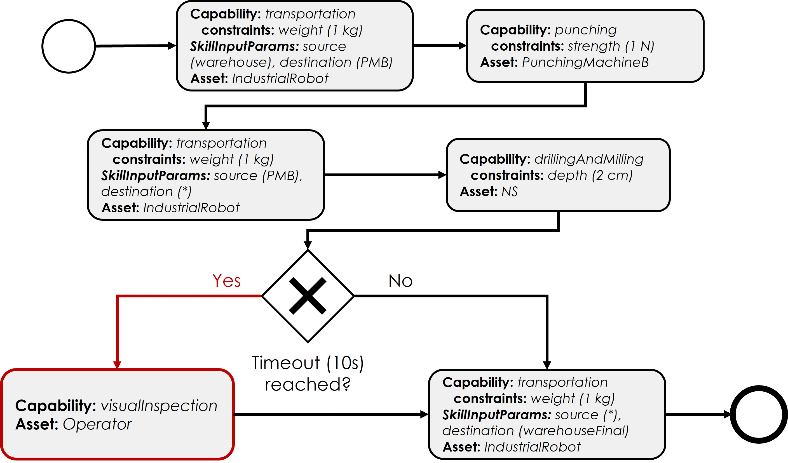
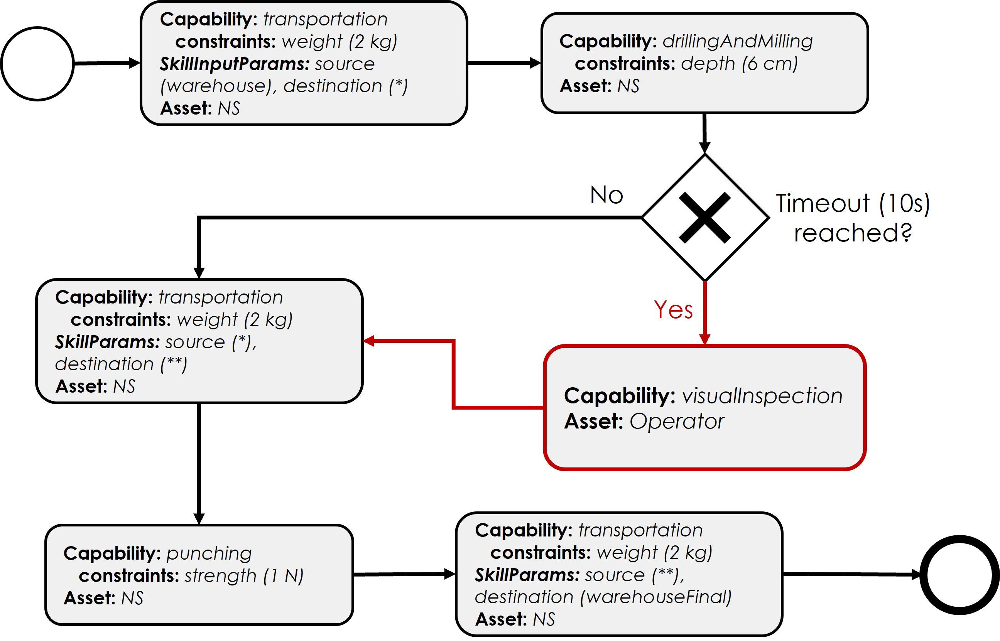

CeDRI IPB demonstrator
======================

.. _CeDRI IPB demonstrator:

This use case represents a flexible production scenario, in which some different asset will interact to realize production plans. This page will detail the use case in relation to its development and implementation and the results obtained.

.. note::

    All the resources developed in the case study are available in the `SMIA repository on GitHub <https://github.com/ekhurtado/SMIA/tree/cedri_ipb_demonstrator/use_cases/cedri_ipb_demonstrator>`_. The use case was validated with SMIA version 0.3.0.

Description of the use case
---------------------------

To validate the solution in a suitable environment, it must feature a flexible production system with different types of assets and different functionalities. The selected demonstrator is therefore a small-scale production system based on Fischertechnik infrastructure, comprised of several machines and warehouses: two punching machines, two indexed lines and one industrial robot. These assets present different functionalities such as transportation, punching or drilling of workpieces. To this infrastructure, a human operator has been added as a new type of asset, capable of transportation and visual inspection of machines’ operation.

Regarding asset control, the punching machines and indexed line are controlled by IEC 61313-3 programs running on a Modicon M340 programmable logic controller (PLC), the ABB robot is controlled by a RAPID-based program, and the human operator has an associated web graphical user interface (GUI). In terms of connectivity, the Fischertechnik infrastructure is accessed through HTTP-based middleware implemented with Node-RED, which modifies the necessary PLC memory using the Modbus protocol. In the case of the human operator, since the web GUI has been developed using SPADE's native web functionalities, it can be directly accessed.

To effectively validate the solution with the demonstrator, it is necessary to identify the functionalities and capabilities of the assets. Since the SMIA approach works with the CSS model as a functional model, the following table presents the CSS information of the assets, as well as the interface to access them.

.. centered:: Identification of demonstrator assets and their capabilities and interfaces.

======================== ================================== ======================== ====================
Asset                    Capability (ies)                   Capability constraints   Accessible through
======================== ================================== ======================== ====================
Industrial robot         Transportation                     Weight (max 1 kg)        HTTP/REST
Punching machine A       Punching                           Strength (max 1N)        HTTP/REST
Punching machine B       Punching                           Strength (max 10N)       HTTP/REST
Indexed line machine A   DrillingAndMilling                 Depth (max 5cm)          HTTP/REST
Indexed line machine B   DrillingAndMilling                 Depth (max 7cm)          HTTP/REST
Human operator           Transportation, VisualInspection   Weight (max 3 kg)        Web GUI
======================== ================================== ======================== ====================

Production plans
~~~~~~~~~~~~~~~~

To efficiently validate the SMIA approach to flexible manufacturing, two production plans have been designed:

* Production A: focused on automatic production through distributed asset selection

* Production B: focused on collaborative production between humans and machines through restricted capabilities for asset selection.

Development of the use case
---------------------------

For assets based on Fischertechnik infrastructure, only the associated AAS models need to be developed, as SMIA v0.3.0 (on which this use case is based) already has HTTP asset connection support.

For human operators, as control is performed via a web graphical user interface developed with native SPADE tools, it can be hosted within the SMIA agent. A special type of SMIA software has been developed for this type of asset: SMIA HI (Human Interface). These types of SMIA instances have the web graphical user interface integrated within the agent along with the necessary controllers to manage it.

.. note::

    The SMIA HI can be used via its Docker image: :bdg-primary:`ekhurtado/smia-tools:latest-smia-hi`. Its source code is also available at `<https://github.com/ekhurtado/SMIA/tree/main/additional_tools/smia_hi>`_.

Deployment of the use case
--------------------------

For this use case it has been decided to deploy SMIA using the Docker Compose method, as it offers the possibility of a self-contained deployment. This way, everything necessary is added in the ``docker-compose-yml`` file and the complete use case can be deployed with a simple command, as Docker Compose takes care of starting the containers and enabling communication between them. All the necessary infrastructure has also been added, as well as the dependency between them using the ``depends_on`` attributes.

.. code:: bash

        docker-compose up

.. dropdown:: ``docker-compose.yml`` file of the use case
    :octicon:`file-code;1em;sd-text-primary`

    .. code:: yaml

        services:

          # ----------------------------------------
          # AAS Infrastructure services (from BaSyx)
          # ----------------------------------------
          aas-env:
            image: eclipsebasyx/aas-environment:2.0.0-SNAPSHOT
            container_name: aas-env
            environment:
              - SERVER_PORT=8081
            volumes:
              - ./aas:/application/aas
              - ./basyx/aas-env.properties:/application/application.properties
            ports:
              - '8081:8081'
            restart: always
            depends_on:
              aas-registry:
                condition: service_healthy
              sm-registry:
                condition: service_healthy
              mongo:
                condition: service_healthy
          aas-registry:
            image: eclipsebasyx/aas-registry-log-mongodb:2.0.0-SNAPSHOT
            container_name: aas-registry
            ports:
              - '8082:8080'
            environment:
              - SERVER_PORT=8080
            volumes:
              - ./basyx/aas-registry.yml:/workspace/config/application.yml
            restart: always
            depends_on:
              mongo:
                condition: service_healthy
          sm-registry:
            image: eclipsebasyx/submodel-registry-log-mongodb:2.0.0-SNAPSHOT
            container_name: sm-registry
            ports:
              - '8083:8080'
            environment:
              - SERVER_PORT=8080
            volumes:
              - ./basyx/sm-registry.yml:/workspace/config/application.yml
            restart: always
            depends_on:
              mongo:
                condition: service_healthy
          mongo:
            image: mongo:5.0.10
            container_name: mongo
            environment:
              MONGO_INITDB_ROOT_USERNAME: mongoAdmin
              MONGO_INITDB_ROOT_PASSWORD: mongoPassword
            restart: always
            healthcheck:
              test: mongo
              interval: 10s
              timeout: 5s
              retries: 5
          aas-web-ui:
            image: eclipsebasyx/aas-gui:SNAPSHOT
            container_name: aas-ui
            ports:
              - '3000:3000'
            environment:
              AAS_REGISTRY_PATH: http://localhost:8082/shell-descriptors
              SUBMODEL_REGISTRY_PATH: http://localhost:8083/submodel-descriptors
              AAS_REPO_PATH: http://localhost:8081/shells
              SUBMODEL_REPO_PATH: http://localhost:8081/submodels
              CD_REPO_PATH: http://localhost:8081/concept-descriptions
              AAS_DISCOVERY_PATH: http://localhost:8084/lookup/shells
              PRIMARY_COLOR: '#347EE1'
              LOGO_PATH: SMIA_logo.ico
            restart: always
            depends_on:
              aas-env:
                condition: service_healthy
            volumes:
              - ./logo:/usr/src/app/dist/Logo

          # ----------------------------
          # SMIA Infrastructure services
          # ----------------------------
          xmpp-server:
            image: ghcr.io/processone/ejabberd
            container_name: ejabberd
            environment:
              - ERLANG_NODE_ARG=admin@ejabberd
              - ERLANG_COOKIE=dummycookie123
              - CTL_ON_CREATE=! register admin localhost asd
            ports:
              - "5222:5222"
              - "5269:5269"
              - "5280:5280"
              - "5443:5443"
            volumes:
              - ./xmpp_server/ejabberd.yml:/opt/ejabberd/conf/ejabberd.yml
            healthcheck:
              test: netstat -nl | grep -q 5222
              start_period: 5s
              interval: 5s
              timeout: 5s
              retries: 10

          smia-kb:
            image: ekhurtado/smia-tools:latest-smia-kb
            container_name: smia-kb
            ports:
              - '8090:8080'
            environment:
              - AAS_ENV_IP=http://aas-env:8081
              #- SELF_EXTRACT_CSS=yes
            depends_on:   # It does not depend on the AAS environment, but is added to correctly obtain all the data during the start-up
              aas-env:
                condition: service_healthy
            # volumes:
            #   - ./smia_kb:/smia_kb
            healthcheck:
              test: wget --no-verbose --tries=1 --spider http://smia-kb:8080/api/v3/ui/ || exit 1
              interval: 10s
              timeout: 5s
              retries: 5
              start_period: 5s

          smia-ism:
            image: ekhurtado/smia-tools:latest-smia-ism
            container_name: smia-ism
            environment:
              - AAS_MODEL_NAME=SMIA_InfrastructureServicesManager.aasx
              - AGENT_ID=smia-ism@ejabberd
              - AGENT_PSSWD=gciscedri1234
              - SMIA_KB_IP=http://smia-kb:8080
            depends_on:
              xmpp-server:
                condition: service_healthy
              smia-kb:
                condition: service_healthy
            healthcheck:
              test: exit 0
              start_period: 15s
            volumes:
              - ./aas:/smia_archive/config/aas

          # -----------------------------
          # CeDRI Infrastructure services
          # -----------------------------
          nodered:
            image: nodered/node-red
            container_name: nodered
            ports:
              - 1880:1880
            volumes:
              - ./nodered:/data

          # -------------------------
          # SMIA instances for assets
          # -------------------------
          smia-industrial-robot:
            image: ekhurtado/smia:0.3.0-alpine
            container_name: smia-industrial-robot
            environment:
              - AAS_MODEL_NAME=CeDRI_IndustrialRobot_instance.aasx
              - AGENT_ID=smia-cedri-industrial-robot@ejabberd
              - AGENT_PSSWD=gciscedri1234
            depends_on:
              xmpp-server:
                condition: service_healthy
              smia-ism:
                condition: service_healthy
            volumes:
              - ./aas:/smia_archive/config/aas

          smia-punching-machine-a:
            image: ekhurtado/smia:0.3.0-alpine
            container_name: smia-punching-machine-a
            environment:
              - AAS_MODEL_NAME=CeDRI_PunchingMachine_instanceA.aasx
              - AGENT_ID=smia-punchingmachine-a@ejabberd
              - AGENT_PSSWD=gciscedri1234
            depends_on:
              xmpp-server:
                condition: service_healthy
              smia-ism:
                condition: service_healthy
            volumes:
              - ./aas:/smia_archive/config/aas

          smia-punching-machine-b:
            image: ekhurtado/smia:0.3.0-alpine
            container_name: smia-punching-machine-b
            environment:
              - AAS_MODEL_NAME=CeDRI_PunchingMachine_instanceB.aasx
              - AGENT_ID=smia-punchingmachine-b@ejabberd
              - AGENT_PSSWD=gciscedri1234
            depends_on:
              xmpp-server:
                condition: service_healthy
              smia-ism:
                condition: service_healthy
            volumes:
              - ./aas:/smia_archive/config/aas

          smia-indexed-line-a:
            image: ekhurtado/smia:0.3.0-alpine
            container_name: smia-indexed-line-a
            environment:
              - AAS_MODEL_NAME=CeDRI_IndexedLine_instanceA.aasx
              - AGENT_ID=smia-indexedline-a@ejabberd
              - AGENT_PSSWD=gciscedri1234
            depends_on:
              xmpp-server:
                condition: service_healthy
              smia-ism:
                condition: service_healthy
            volumes:
              - ./aas:/smia_archive/config/aas

          smia-indexed-line-b:
            image: ekhurtado/smia:0.3.0-alpine
            container_name: smia-indexed-line-b
            environment:
              - AAS_MODEL_NAME=CeDRI_IndexedLine_instanceB.aasx
              - AGENT_ID=smia-indexedline-b@ejabberd
              - AGENT_PSSWD=gciscedri1234
            depends_on:
              xmpp-server:
                condition: service_healthy
              smia-ism:
                condition: service_healthy
            volumes:
              - ./aas:/smia_archive/config/aas

          smia-hi-operator:
            image: ekhurtado/smia-tools:latest-smia-hi
            container_name: smia-hi-operator
            environment:
              - AAS_MODEL_NAME=CeDRI_Operator_instance.aasx
              - AGENT_ID=smia-hi-operator@ejabberd
              - AGENT_PSSWD=gciscedri1234
            depends_on:
              xmpp-server:
                condition: service_healthy
              smia-ism:
                condition: service_healthy
            volumes:
              - ./aas:/smia_archive/config/aas
            ports:
              - 10010:10000

          # SMIA Planning Execution
          smia-pe:
            image: ekhurtado/smia-tools:latest-smia-pe
            container_name: smia-pe
            environment:
              - AAS_MODEL_NAME=SMIA_PE_CeDRI_ScenarioA.aasx
              #- AAS_MODEL_NAME=SMIA_PE_CeDRI_ScenarioB.aasx
              - AGENT_ID=smia-pe@ejabberd
              - AGENT_PSSWD=gciscedri1234
            depends_on:
              xmpp-server:
                condition: service_healthy
              smia-ism:
                condition: service_healthy
            volumes:
              - ./aas:/smia_archive/config/aas
            ports:
              - 10000:10000

.. note::

    The Docker Compose presented above collects all the necessary containers, but to facilitate the development of multiple tests, there are also some Docker Composes available that are divided between the infrastructure (available at `SMIA GitHub repository <https://raw.githubusercontent.com/ekhurtado/SMIA/refs/heads/cedri_ipb_demonstrator/use_cases/cedri_ipb_demonstrator/deploy/docker-compose-infrastructure.yml>`_) and the SMIA instances (available at `SMIA GitHub repository <https://raw.githubusercontent.com/ekhurtado/SMIA/refs/heads/cedri_ipb_demonstrator/use_cases/cedri_ipb_demonstrator/deploy/docker-compose-instances.yml>`_). Both Docker Compose have been configured to enable communication between all containers.

    This way, you can deploy the infrastructure on one side by running the following command:

    .. code:: bash

        docker-compose -f docker-compose-infrastructure.yml up

    and run the instances on the other side with:

    .. code:: bash

        docker-compose -f docker-compose-instances.yml up

Use case results
----------------

During the development of the case study and the validation performed in its application, some results and conclusions have been obtained:

* Having a standard such as :term:`AAS` as a basis, although it may seem complex at first, offers many advantages. A key advantage is that if SMIA is compatible with the asset interface, only its AAS models need to be developed (as is the case with the entire Fischertechnik infrastructure).
* The integration of an architectural style focused on flexible manufacturing, such as the CSS model, offers simplicity when encapsulating asset functionality and using it in production. It also allows the description of functionality to be separated from its implementation (e.g., both industrial robots and human operators offer transport capacity, but the execution is completely different).
* The solution offers several ways to select assets for each step of the process: directly specifying the asset identifier, specifying a capacity constraint that must be met, or leaving the decision to the SMIA instances via the FIPA-CNP protocol. It has been concluded that all methods have worked satisfactorily in this use case.
* It has been concluded that an efficient discovery system is necessary to know the available SMIAs and therefore the available assets. This is because a global knowledge of the system is necessary in solutions that require interactions between different components. For this use case, SMIA KB has been developed to meet this requirement.
