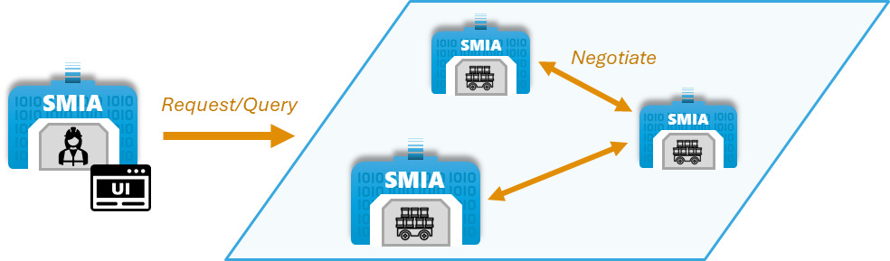
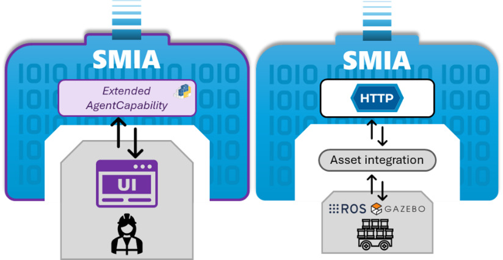

Cooperative transport logistics
===============================

.. _Use case transport logistics:

This use case represents a robotic logistics production scenario, in which a plant operator will request efficient transports performed by robots. This page will detail the use case in relation to its development and implementation and the results obtained.

.. note::

    All the resources developed in the case study are available in the `SMIA repository on GitHub <https://github.com/ekhurtado/SMIA/tree/cooperative_transport_logistics/use_cases/cooperative_transport_logistics>`_.

Description of the use case
---------------------------

The objective is to enable operators to manage logistics through efficient transports. The efficiency of the transport is achieved by considering that each robot is limited in relation to the weight of the load, so the operator must know which robots are capable of performing each transport, and can request them to send or pick up products. Since it is possible for several robots to meet the transport weight requirement, it is possible to decide how the transport will be performed: by selecting a specific robot or by launching a negotiation request among the contenders for the most suitable option to perform it.

The operator represents a worker who must be able to interact with the system in order to perform the transport requests, so a Graphical User Interface (GUI) is required to interact within the SMIA ecosystem. On the other hand, it should be noted that the experiments have been performed in a simulated scenario for the ROS Noetic distribution including Turtlebot 3 Waffle Pi robots. The following figure graphically represents the use case:

Development of the use case
---------------------------

The assets identified in this case study are physical, but operator accessibility is achieved through a GUI, while ROS-based robots can be managed through HTTP-based asset integration. The SPADE development platform provides the ability to add customized, web-accessible GUIs to the agents. Using this functionality, an extension of SMIA has been developed that adds a new agent capability which is in charge of managing the GUI offered by SPADE. In this way the operator can interact within the SMIA ecosystem. For transport robots it is not necessary to extend SMIA, since SMIA base presents connection with active via HTTP. Both cases are graphically presented in the following figure:

Deployment of the use case
--------------------------

For this use case it has been decided to deploy SMIA using the Docker Compose method, as it offers the possibility of a self-contained deployment. This way, everything necessary is added in the ``docker-compose-yml`` file and the complete use case can be deployed with a simple command, as Docker Compose takes care of starting the containers and enabling communication between them.

.. dropdown:: ``docker-compose.yml`` file of the use case
    :octicon:`file-code;1em;sd-text-primary`

    .. code:: yaml

        services:

          smia-robot-1:
            image: ekhurtado/smia:latest-alpine
            container_name: smia-robot-1
            environment:
              - AAS_MODEL_NAME=SMIA_TransportRobot_article_1.aasx
              - AGENT_ID=transportrobot001@ejabberd
              - AGENT_PSSWD=gcis1234
            depends_on:
              xmpp-server:
                condition: service_healthy
            volumes:
              - ./aas:/smia_archive/config/aas

          smia-robot-2:
            image: ekhurtado/smia:latest-alpine
            container_name: smia-robot-2
            environment:
              - AAS_MODEL_NAME=SMIA_TransportRobot_article_2.aasx
              - AGENT_ID=transportrobot002@ejabberd
              - AGENT_PSSWD=gcis1234
            depends_on:
              xmpp-server:
                condition: service_healthy
            volumes:
              - ./aas:/smia_archive/config/aas

          smia-operator:
            image: ekhurtado/smia-use-cases:latest-operator
            container_name: smia-operator
            environment:
              - AAS_MODEL_NAME=SMIA_Operator_article.aasx
              - AGENT_ID=operator001@ejabberd
              - AGENT_PSSWD=gcis1234
            depends_on:
              xmpp-server:
                condition: service_healthy
            volumes:
              - ./aas:/smia_archive/config/aas
            ports:
              - 10000:10000

          xmpp-server:
            image: ghcr.io/processone/ejabberd
            container_name: ejabberd
            environment:
              - ERLANG_NODE_ARG=admin@ejabberd
              - ERLANG_COOKIE=dummycookie123
              - CTL_ON_CREATE=! register admin localhost asd
            ports:
              - "5222:5222"
              - "5269:5269"
              - "5280:5280"
              - "5443:5443"
            volumes:
              - ./xmpp_server/ejabberd.yml:/opt/ejabberd/conf/ejabberd.yml
            healthcheck:
              test: netstat -nl | grep -q 5222
              start_period: 5s
              interval: 5s
              timeout: 5s
              retries: 10

    .. note::

        Notice how the base image of the SMIA operator is different. This is because the operator is based on an extended SMIA, so a new Docker image has been generated.

SMIA Operator dashboard
~~~~~~~~~~~~~~~~~~~~~~~

TODO aqui se mencionara como usar el dashboard

Use case results
----------------

TODO aqui se mencionaran algunos resultados obtenidos
