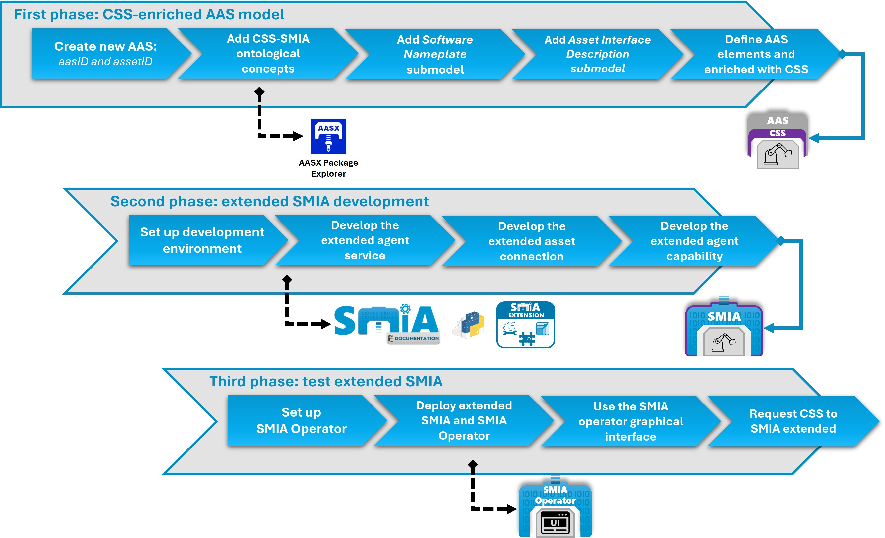
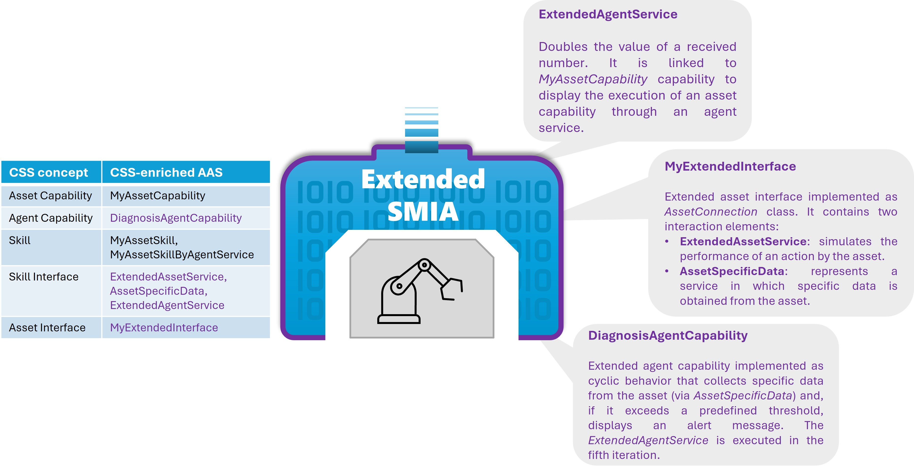

# SMIA tutoriales guiados: extensión

Este documento contiene una guía paso a paso para construir un agente SMIA y dotarlo de inteligencia y autonomía extendida. Se ofrecen los pasos detallados a seguir, así como el código fuente en partes específicas, para poder reproducir el tutorial de desarrollo satisfactoriamente.

### Descripción del Tutorial

El tutorial consta de tres fases, en las que se parte de generar la pre-configuración necesaria como el CSS-enriched AAS model para la instancia SMIA, después se desarrolla la lógica y se extiende el agente con dicha autonomía, y, por último, se prueba y valida el agente desarrollado. Las tres fases se ilustran en la siguiente figura:



El objetivo es aumentar la autonomía del agente usando los tres mecanismos de extensión que ofrece: añadir un servicio de agente, añadir una capacidad de agente, y añadir una interfaz de activo (asset connection). La explicación de cada extensión, así como de los elementos AAS enriquecidos por CSS del activo a definir se presentan en la siguiente figura:



### Objetivo del Tutorial

Al finalizar esta práctica, habrás logrado:
1.  **Modelar:** Crear un modelo AAS enriquecido con CSS que define las capacidades del activo y sirve para habilitar la auto-configuración del agente SMIA.
2.  **Extender:** Desarrollar la lógica que permite añadir autonomía aumentada al agente SMIA, así como inyectarla en el software mediante sus mecanismos de extensiones.
3.  **Validar:** Probar y validar las nuevas capacidades autónomas mediante interacción peer-to-peer entre agentes. Se utilizará el agente **SMIA Operator** para realizar solicitudes a través de una interfaz gráfica intuitiva (abstrayendo la implementación subyacente mediante Lenguaje I4.0).

> [!IMPORTANT]
> Aunque se ofrezca el código final y el fichero CSS-enriched AAS model válido se recomienda seguir el tutorial para comprender el potencial del enfoque SMIA.

### Entorno de desarrollo

Antes de comenzar la parte del tutorial de desarrollo del código, es necesario comprobar que se tienen todos los recursos listos:

1.  **AASX Package Explorer:** Necesario para el desarrollo del CSS-enriched AAS model. Para lograrlo se puede seguir la [guía de instalación de SMIA](https://smia.readthedocs.io/en/latest/smia_user_guide/installation_guide.html#aasx-package-explorer).
2.  **SMIA package:** Necesario para el desarrollo del código y generación del agente extendido. Para lograrlo se puede seguir la [guía de instalación de SMIA](https://smia.readthedocs.io/en/latest/smia_user_guide/installation_guide.html#smia-source-code).
3.  **SMIA Operator:** El agente externo que ofrece interfaz gráfica para realizar solicitudes a agentes SMIA. Se puede obtener del [repositorio de GitHub](https://github.com/ekhurtado/SMIA/tree/main/additional_tools/extended_agents/smia_operator_agent).

## Primera fase: generar el CSS-enriched AAS model

En la primera fase generaremos el CSS-enriched AAS model que servirá al agente SMIA auto-configurarse y obtener toda la información relativa al activo que representará. Los pasos a seguir para generar el modelo desde cero son los siguientes:

1. Abrir la herramienta **``AASX Package Explorer``** y configurarlo para modo edición (``Workspace > Edit``).
2. Crear un nuevo AAS dentro del entorno y definir su _idShort_. También se le añade un identificador para el activo (se puede generar aleatoriamente en _globalAssetId_).
3. Añadir los identificadores ontológicos del modelo CSS en forma de ``ConceptDescriptions``.
	
	1. Añadir el submodelo con los identificadores ontológicos del modelo CSS: ``Workspace > Create ... > New submodel from plugin > AasxPluginGenericForms | GCIS/SubmodelWithCapabilitySkillOntology``.
	2. Desde el submodelo generar los ConceptDescriptions con identificadores ontológicos del modelo CSS: botón ``Create <- SMEs (all)``. Dentro de _ConceptDescriptions_ se habrán generado todos los elementos. El submodelo ya se podría eliminar (botón ``Delete``), así como su ConceptDescription (_SubmodelWithCapabilitySkillOntology_) para que no presente errores más adelante (ya que lo genera con id vacío).

> [!NOTE]
> A partir de la v2025-03-25 las ConceptDescriptions se generan mediante la funcionalidad ``SMEs (all)``, pero esta no es capaz de generar toda la información desde el plugin para el modelo CSS. Si no se desea rellenar toda la información restante (p.e. _shortName_ de cada concepto), es posible obtenerlos desde el recurso base para el desarrollo del CSS-enriched AAS model. Para ello, se puede abrir una nueva ventana de la herramienta ``AASX Package Explorer``, abrir el fichero ``CSS_AAS_model_base.aasx`` que se ofrece en la carpeta de este tutorial, seleccionar y copiar todos los ConceptDescriptions usando el botón ``Copy`` y en nuestro AAS ``Paste into``.

4. Añadir el submodelo para definición del software SMIA: ``Workspace > Create ... > New submodel from plugin > AasxPluginGenericForms | Nameplate for Software in Manufacturing (IDTA) V1.0``.

	1. Eliminar el SubmodelElement ``SoftwareNameplateType`` y modificar el ``SoftwareNameplateInstance``: eliminar todas las apariciones de _{0:00}_.
	2. Especificar el identificador del agente en ``SoftwareNameplateInstance/InstanceName[value]`` (el mismo que después se definirá en el JID en código, aunque en este caso sin el servidor XMPP, es decir, solamente el identificador antes de "@"), y la versión del agente en ``SoftwareNameplateInstance/InstalledVersion[value]`` (p.e. "0.3.1"). Además de este dato obligatorio, los demás son opcionales. Se pueden añadir los datos que se quieran para definir en más profundidad el software SMIA (módulos instalados, OS en el que se despliega, etc.).

> [!NOTE]
> Si no se quiere modificar el submodelo, se puede obtener un submodelo válido con el siguiente proceso: abrir una nueva ventana de la herramienta ``AASX Package Explorer``, abrir el fichero ``CSS_AAS_model_base.aasx`` que se ofrece en la carpeta de este tutorial y copiar el submodelo "SoftwareNameplate" usando el botón ``Copy`` y en nuestro AAS ``Paste into``.

_El paso 5 solo hay que realizarlo si el agente requiere conexión con el activo._

5. Añadir el submodelo para definición de la interfaz del activo que representará el agente SMIA: ``Workspace > Create ... > New submodel from plugin > AasxPluginGenericForms | AssetInterfacesDescription (IDTA) V1.0``. 	Definir completamente el _SubmodelElementCollection_ relativo a los protocolos que soporta el activo.

	1. En este tutorial, se va a extender SMIA con una nueva interfaz, por lo que definimos un _SubmodelElementCollection_ como ``MyExtendedInterface``. 
	2. Para probar y validar la nueva interfaz, se modificará el elemento _EndpointMetadata/base_ con un endpoint inventado (p.e. "http://localhost:8080"), simplemente para poder comprobarlo en el código a desarrollar en los siguientes pasos.
	3. Para probar y validar un asset service, se modificará el primer elemento de _InteractionMetadata/properties/_. Se modificará su _idShort_ (p.e. _ExtendedAssetService_) y el valor de su datapoint en _forms/href/_ (p.e. _/extendedservice_).
	4. Para probar el acceso a un dato del activo a través de una capacidad de agente extendida (desarrollada más adelante en este tutorial), se copiará el elemento de _InteractionMetadata/properties/_ y se modificará su _idShort_ (p.e. _AssetSpecificData_) y el valor de su datapoint en _forms/href/_ (p.e. _/assetdata_).

> [!NOTE]
> El submodelo hay que definirlo completamente para que no presente errores durante el arranque de SMIA. Si se desea modificar un submodelo válido se puede abrir una nueva ventana de la herramienta ``AASX Package Explorer``, abrir el fichero ``CSS_AAS_model_base.aasx`` que se ofrece en la carpeta de este tutorial y copiar el submodelo "AssetInterfacesDescription" usando el botón ``Copy`` y en nuestro AAS ``Paste into``.

6. Definir los submodelos con la información del activo. Para ello, creamos los submodelos en el AAS mediante ``Create new Submodel of kind Instance``. Para este tutorial vamos a definir dos submodelos para distinguir la información del activo y su representante (agente SMIA), y las relaciones ontológicas de los CSS-enriched elements: ``AssetFunctionalInformation`` y ``AgentFunctionalInformation``, y ``FunctionalRelationships``.

	1. Definimos el submodelo ``AssetFunctionalInformation``, añadiendo los siguientes SubmodelElements: Capability con idShort _MyAssetCapability_,  Operation con idShort _MyAssetSkill_, Operation con idShort _MyAssetSkillByAgentService_, y Range con idShort _MyAssetCapConstraint_ (con un tipo "xs:float" y valores min: 0.0 y max: 5.0).
	2. Definimos el submodelo ``AgentFunctionalInformation``, añadiendo los siguientes SubmodelElements: Property con idShort _DiagnosisAgentCapability_,  Operation con idShort _DiagnosisSkill_, y Operation con idShort _ExtendedAgentService_ (con un Property en OperationVariable In con idShort _extended_param_).

7. Enriquecer semánticamente los SubmodelElements con los conceptos ontológicos del CSS model. Para ello, en cada elemento creado se añade el ``semanticID`` correspondiente.

	1. En cada SubmodelElement a enriquecer, crear un semanticID vacío (``Create w/ default!``), después ``Add existing`` y seleccionar entre los ConceptDescriptions los identificadores relativos a cada elemento (p.e. "http://www.w3id.org/upv-ehu/gcis/css-smia#AssetCapability" para las capacidades de activo).
	2. Definimos el submodelo ``FunctionalRelationships``, añadiendo un RelationshipElement para cada relación ontológica, añadiendo su semanticID siguiendo el procedimiento del paso ``7.1``, y enlazando los elementos en los parámetros ``first`` y ``second`` (usar el botón ``Add existing`` para seleccionar los elementos).
	3. Definimos los _Qualifiers_ para las capacidades, skills y constraints. Para ello, creamos un qualifier vacío (``Create w/ default!``), después ``Add preset`` y seleccionar el calificador asociado entre los ``GCIS | CSS | ``.

8. Guardar el fichero AASX con la definición completa del CSS-enriched AAS model válido. Para ello, usamos el menú: ``File > Save as ...``, seleccionamos la carpeta donde se guardará el CSS-enriched AAS model y el nombre para el fichero AASX.


## Segunda fase: desarrollar la lógica para extender SMIA

En esta fase se desarrollará la lógica con la autonomía aumentada que se usará para extender el agente SMIA. Para ello, se dividirá en varias partes, atendiendo a diferentes aspectos a extender.

### Configuración del entorno de desarrollo y despliegue

Para desarrollar y probar el agente SMIA extendido se debe habilitar un entorno con acceso al entorno Python (con el paquete SMIA instalado). En este entorno, en esta fase simplemente probaremos que el CSS-enriched AAS model que hemos generado es válido y que somos capaces de arrancar un agente SMIA. Para ello, sigue los siguientes pasos:

1. Copiar el fichero AASX con el CSS-enriched AAS model que hemos generado al entorno de desarrollo.
2. Crear una carpeta para añadir el código fuente a desarrollar (p.e. ``src/``).
3. Dentro de la carpeta generada (``src/``), crear un fichero launcher que sirva de arranque del agente SMIA. Siguiendo la [guía de extensión de SMIA](https://smia.readthedocs.io/en/latest/smia_user_guide/extension_guide.html), añade el código ofrecido con un ``ExtensibleSMIAAgent``. En la línea de cargar el modelo AAS, define el fichero AASX que acabamos de generar (si está en la carpeta principal, añade _'../'_). 

> [!NOTE]
> SMIA ofrece diferentes mecanismos de despliegue. Se recomienda desplegar SMIA usando contenedores Docker para asegurar su funcionamiento en cualquier entorno. Sin embargo, para realizar las pruebas en este tutorial, se ejecutará en local. Para ello es necesario habilitar la conexión con el servidor XMPP, ya sea uno local o un servidor en Internet como p.e. xmpp.jp (requiere registrar el JID y la contraseña previamente en [https://www.xmpp.jp/](https://www.xmpp.jp/)). Por lo tanto, el código final queda de esta manera:

```python
import smia
from smia.agents.extensible_smia_agent import ExtensibleSMIAAgent

def main():
    # First, the initial configuration must be executed
    smia.initial_self_configuration()

    # The AAS model is added to SMIA
    smia.load_aas_model('../SMIA_extension_guided_tutorial.aasx')

    # Create and run the extensible agent object
    my_extensible_smia_agent = ExtensibleSMIAAgent('gcis1@xmpp.jp', 'gcis1234')
    smia.run(my_extensible_smia_agent)

if __name__ == '__main__':
    main()
```

4. Arrancar el agente SMIA ejecutando el fichero ``launcher.py``. El agente SMIA generará una carpeta ``smia_archive`` con los ficheros de configuración, junto al CSS-enriched AAS model definido. 

> [!NOTE]
> Durante el arranque fallará, debido a que no dispone del fichero OWL con la definición de la ontología del modelo CSS. Este fichero se puede obtener del [repositorio de GitHub](https://github.com/ekhurtado/SMIA/blob/main/additional_resources/css_smia_ontology/CSS-ontology-smia.owl) y se debe copiar en ``smia_archive/config/``. Después de copiar el fichero OWL, se puede volver a ejecutar el ``launcher.py`` y esta vez el agente SMIA arrancará perfectamente.


### Desarrollo del servicio de agente extendido

En el CSS-enriched AAS model se ha definido un ``ExtendedAgentService``, el cual se ejecuta a través de la solicitud del ``MyAssetCapability`` con la implementación ``MyAssetSkillByAgentService``. Es decir, se trata de un ejemplo de una capacidad de activo que se ejecuta en el propio representante digital (agente).

Para desarrollarlo, crearemos un fichero python (p.e. ``extended_services.py``) dentro de la carpeta ``src/`` y programaremos su lógica, teniendo en cuenta que tiene un parámetro de entrada ``extended_param``. Este servicio duplica el valor recibido y lo devuelve. El código resultante es el siguiente:

```python
def extended_agent_service(extended_param: int):
    print("Hi! I am an extended agent service for duplicating numbers...")
    try:
        result = int(extended_param) * 2
        print("The value received and duplicate value: {}, {}".format(extended_param, result))
        return result
    except Exception as e:
        print("ERROR: The received parameter is not an integer: {}".format(extended_param))
```

Para extender el agente SMIA con el nuevo servicio de agente, importamos el método en el ``launcher.py`` y añadimos el servicio mediante el mecanismo de extensión de SMIA: ``agent.add_new_agent_service()``. Es importante añadir en el parámetro ``service_id`` el idShort del SubmodelElement definido en el CSS-enriched AAS model (en este caso _ExtendedAgentService_). Esta línea hay que añadirla después de generar el agente y antes de arrancarlo mediante ``smia.run()``. El código a añadir en el launcher es el siguiente:

```python
from extended_services import extended_agent_service

[...]
	
	# Create and run the extensible agent object
    my_extensible_smia_agent = ExtensibleSMIAAgent('gcis1@xmpp.jp', 'gcis1234')

    # Add the extended agent service
    my_extensible_smia_agent.add_new_agent_service('ExtendedAgentService', extended_agent_service)

[...]

```

Si se desea probar el servicio ejecutándolo manualmente, se puede añadir el siguiente código antes del ``smia.run()``, añadiendo los parámetros necesarios (en este caso ``extended_param``):

```python
import asyncio

[...]

    # Add the extended agent service
    my_extensible_smia_agent.add_new_agent_service('ExtendedAgentService', extended_agent_service)

    try:
        asyncio.run(my_extensible_smia_agent.agent_services.execute_agent_service_by_id('ExtendedAgentService', extended_param=26))
    except Exception as e:
        print("ERROR: An agent service cannot be executed.")

    smia.run(my_extensible_smia_agent)

```

### Desarrollo de la conexión extendida con el activo

Dentro del submodelo ``AssetInterfacesDescription`` del CSS-enriched AAS model se ha definido un ``MyExtendedInterface``. Esta nueva interfaz representa un assetconnection extendido en el agente SMIA. Para desarrollarlo, crearemos un fichero python (p.e. ``extended_asset_interface.py``) dentro de la carpeta ``src/`` y programaremos su lógica. Al ser un assetconnection, debe ser una clase heredada del ``smia.assetconnection.asset_connection.AssetConnection``, que contenga todos sus métodos. Un ejemplo con la estructura básica se presenta en la [guía de extensión de SMIA](https://smia.readthedocs.io/en/latest/smia_user_guide/extension_guide.html#creating-new-assetconnection-class).

En este caso, definiremos la clase como ``MyExtendedInterface`` y añadiremos la lógica deseada. Por una parte, añadiremos la lógica de configuración de la nueva conexión de activo, que en este tutorial simplemente comprobaremos que los SubmodelElements de _InterfaceElement_ y _EndpointMetadata_ son válidos y presentaremos la base definida para su acceso. 

Por otra parte, añadiremos la lógica para simular la conexión con el activo en el método ``execute_asset_service()``. El objetivo es simular la conexión con el activo en relación a los dos elementos definidos en el AAS. ``ExtendedAssetService`` simula la realización de una acción por parte del activo, presentando por consola una barra de progreso. ``AssetSpecificData`` representa un servicio en el que se obtiene un dato específico desde el activo. La simulación se realiza mediante la generación de un número aleatorio. El código resultante de la interfaz de activo extendida es el siguiente:

```python
import asyncio
import logging
import random

from smia.assetconnection.asset_connection import AssetConnection
from smia.utilities.smia_info import AssetInterfacesInfo

_logger = logging.getLogger(__name__)

class MyExtendedInterface(AssetConnection):

    def __init__(self):
        # If the constructor will be overridden remember to add 'super().__init__()'.
        pass

    async def configure_connection_by_aas_model(self, interface_aas_elem):
        # The Interface element need to be checked
        await self.check_interface_element(interface_aas_elem)

        # General information about the connection to the asset is defined in the SMC 'EndpointMetadata'.
        self.endpoint_metadata_elem = interface_aas_elem.get_sm_element_by_semantic_id(
            AssetInterfacesInfo.SEMANTICID_ENDPOINT_METADATA)

        # The endpointMetadata element need to be checked
        await self.check_endpoint_metadata()

        base_property = self.endpoint_metadata_elem.get_sm_element_by_semantic_id(
            AssetInterfacesInfo.SEMANTICID_INTERFACE_BASE)
        _logger.assetinfo("Base endpoint of extended interface: {}".format(base_property.id_short))

    async def check_asset_connection(self):
        pass

    async def connect_with_asset(self):
        pass

    async def execute_asset_service(self, interaction_metadata, service_input_data=None):
        _logger.info("Hi! I am an Extended Interface that can simulate the connection to an asset.")
        _logger.info("The given AAS element is {}".format(interaction_metadata.id_short))

        if interaction_metadata.id_short == 'ExtendedAssetService':
            _logger.assetinfo("Executing the requested extended asset service...")
            steps = 5
            for i in range(steps + 1):
                await asyncio.sleep(.5)
                bar = '>>' * i + '-' * (steps - i) * 2
                _logger.assetinfo(f"[{bar}] {int((i / steps) * 100)}%")
            _logger.assetinfo("Extended asset service completed successfully.")
            result = {'status': 'OK'}
        elif interaction_metadata.id_short == 'AssetSpecificData':
            _logger.assetinfo("Obtaining the requested asset data...")
            result = round(random.uniform(0, 100), 2)
            _logger.assetinfo("The requested asset data value is: {}".format(result))
        else:
            result = {'status': 'OK'}

        return result

    async def receive_msg_from_asset(self):
        pass
```

Para extender el agente SMIA con el nuevo servicio de agente, importamos la clase en el ``launcher.py``, creamos una instancia de la clase y la añadimos mediante el mecanismo de extensión de SMIA: ``agent.add_new_asset_connection()``. Es importante añadir en el parámetro ``service_id`` el idShort del SubmodelElement definido en el CSS-enriched AAS model (en este caso _MyExtendedInterface_). Esta línea hay que añadirla después de generar el agente y antes de arrancarlo mediante ``smia.run()``. Por lo tanto, el código a añadir en el launcher es el siguiente: 

```python
from extended_asset_interface import MyExtendedInterface

[...]
	
	# Create and run the extensible agent object
    my_extensible_smia_agent = ExtensibleSMIAAgent('gcis1@xmpp.jp', 'gcis1234')

    # Add the extended Asset Interface (AssetConnection)
    extended_asset_interface = MyExtendedInterface()
    my_extensible_smia_agent.add_new_asset_connection('MyExtendedInterface', extended_asset_interface)

[...]

```

Si se desea probar la interfaz extendida y los servicios de activo que ofrece manualmente, se puede añadir el siguiente método ``test_asset_connection`` y ejecutarlo antes del ``smia.run()``. Las interfaces de los activos se obtienen desde su relación elementos AAS enriquecidos mediante el concepto ontológico de SkillInterface. Por ello, para solicitar un servicio de activo, es necesario definir una referencia al elemento AAS de su interfaz dentro del submodelo _AssetInterfacesDescription_. Esta referencia puede ser generada copiando (``Copy to clipboard``) elementos referenciados en ``RelationshipElement`` ("first" o "second") desde ``AASX Package Explorer`` y transformando los datos en JSON.

```python
import smia

async def test_asset_connection(myagent):
    aas_interface_ref = await smia.AASModelUtils.create_aas_reference_object(
        reference_type='ModelReference', keys_dict=[
            {'type': 'SUBMODEL', 'value': 'https://example.com/ids/sm/6505_6142_2052_5708'},
            {'type': 'SUBMODEL_ELEMENT_COLLECTION', 'value': 'MyExtendedInterface'},
            {'type': 'SUBMODEL_ELEMENT_COLLECTION', 'value': 'InteractionMetadata'},
            {'type': 'SUBMODEL_ELEMENT_COLLECTION', 'value': 'properties'},
            # {'type': 'SUBMODEL_ELEMENT_COLLECTION', 'value': 'ExtendedAssetService'},
            {'type': 'SUBMODEL_ELEMENT_COLLECTION', 'value': 'AssetSpecificData'},
        ])

    aas_interface_elem = await myagent.aas_model.get_object_by_reference(aas_interface_ref)
    new_asset_conn_ref = await smia.AASModelUtils.create_aas_reference_object(
        reference_type='ModelReference', keys_dict=[
            {'type': 'SUBMODEL', 'value': 'https://example.com/ids/sm/6505_6142_2052_5708'},
            {'type': 'SUBMODEL_ELEMENT_COLLECTION', 'value': 'MyExtendedInterface'},
        ])
    new_asset_conn_class = await myagent.get_asset_connection_class_by_ref(new_asset_conn_ref)
    result = await new_asset_conn_class.execute_asset_service(interaction_metadata=aas_interface_elem)
    print("An asset service has been executed with the new MyExtendedAssetConnection with result: {}".format(result))

def main():
	[...]

    # Add the extended Asset Interface (AssetConnection)
    extended_asset_interface = MyExtendedInterface()
    my_extensible_smia_agent.add_new_asset_connection('MyExtendedInterface', extended_asset_interface)

    try:
    	# Executing asset service in extended interface...
        asyncio.run(test_asset_connection(my_extensible_smia_agent))
    except Exception as e:
        print("ERROR: An asset interface is not working properly.")

    smia.run(my_extensible_smia_agent)

```


### Desarrollo de la capacidad extendida del agente

En el CSS-enriched AAS model se ha definido un ``DiagnosisAgentCapability`` como capacidad de agente. Como esta capacidad no la ofrece SMIA base, es necesario desarrollar su lógica y añadirla mediante extensión. Esta nueva capacidad representa la autonomía para análisis de diagnóstico de un dato específico del activo. Para desarrollar su lógica crearemos un fichero python (p.e. ``extended_agent_capability.py``) dentro de la carpeta ``src/`` y añadiremos la clase para la capacidad de agente. Como se trata de una autonomía que requiere mantenerse activa, entre las opciones que ofrece SPADE mencionadas en la [guía de extensión de SMIA](https://smia.readthedocs.io/en/latest/smia_user_guide/extension_guide.html#adding-new-agent-capabilities), el comportamiento apropiado es el ``CyclicBehaviour`` (se ofrece un ejemplo en la [documentación de SPADE](https://spade-mas.readthedocs.io/en/latest/usage.html#an-agent-with-a-behaviour)).

En este caso, definiremos la clase como ``DiagnosisAgentCapability``, que hereda de _CyclicBehaviour_, y añadiremos la lógica deseada. En el constructor recogeremos el objeto del agente SMIA, para tenerlo accesible. En el método ``run()`` añadiremos la lógica para ofrecer la autonomía de la capacidad. En este caso se ha definido un comportamiento cíclico que se ejecuta cada 3 segundos. Solicita el servicio de activo para obtener el dato específico y, en caso de superar el umbral predefinido, presenta un mensaje de alerta de que se debe lanzar un evento. Para también presentar la facilidad de ejecución de servicios de agente, en la quinta iteración se ejecuta el servicio de agente extendido previamente. El código resultante de la capacidad de agente es el siguiente:

```python
import asyncio
import logging

import smia
from spade.behaviour import CyclicBehaviour

_logger = logging.getLogger(__name__)

class DiagnosisAgentCapability(CyclicBehaviour):

    def __init__(self, agent_object):
        super().__init__()

        self.interaction_num = 0
        self.event_threshold = 60.0
        self.myagent = agent_object

    async def run(self) -> None:

        _logger.info("Hi! I am an extended DiagnosisAgentCapability with interaction number: {}".format(self.interaction_num))
        self.interaction_num += 1

        try:
            if self.interaction_num == 5:
                # Let's execute the new extended agent service
                _logger.info("---------------------")
                result = await self.myagent.agent_services.execute_agent_service_by_id(
                    'ExtendedAgentService', extended_param=self.interaction_num)
                _logger.info("The result of the new agent service ExtendedAgentService is {}".format(result))
                _logger.info("---------------------")

            # Let's execute an asset service using the new Asset Connection
            aas_interface_ref = await smia.AASModelUtils.create_aas_reference_object(
                reference_type='ModelReference', keys_dict=[
                    {'type': 'SUBMODEL', 'value': 'https://example.com/ids/sm/6505_6142_2052_5708'},
                    {'type': 'SUBMODEL_ELEMENT_COLLECTION', 'value': 'MyExtendedInterface'},
                    {'type': 'SUBMODEL_ELEMENT_COLLECTION', 'value': 'InteractionMetadata'},
                    {'type': 'SUBMODEL_ELEMENT_COLLECTION', 'value': 'properties'},
                    {'type': 'SUBMODEL_ELEMENT_COLLECTION', 'value': 'AssetSpecificData'},
                ])
            aas_interface_elem = await self.myagent.aas_model.get_object_by_reference(aas_interface_ref)
            new_asset_conn_ref = await smia.AASModelUtils.create_aas_reference_object(
                reference_type='ModelReference', keys_dict=[
                    {'type': 'SUBMODEL', 'value': 'https://example.com/ids/sm/6505_6142_2052_5708'},
                    {'type': 'SUBMODEL_ELEMENT_COLLECTION', 'value': 'MyExtendedInterface'},
                ])
            new_asset_conn_class = await self.myagent.get_asset_connection_class_by_ref(new_asset_conn_ref)
            result = await new_asset_conn_class.execute_asset_service(interaction_metadata=aas_interface_elem)
            _logger.info("An asset service has been executed with the new MyExtendedInterface with result: {}".format(
                    result))
            if result > self.event_threshold:
                _logger.warning("The asset data has exceeded the defined threshold. An event must be triggered.")

        except Exception as e:
            _logger.error("An error occurred: {}".format(e))

        await asyncio.sleep(3)    # waits 3 seconds in every cyclic execution

```

Para extender el agente SMIA con la nueva capacidad de agente, importamos la clase en el ``launcher.py``, creamos una instancia de la clase (ofreciendo la instancia del agente), y la añadimos mediante el mecanismo de extensión de SMIA: ``agent.add_new_agent_capability()``. Esta línea hay que añadirla después de generar el agente y antes de arrancarlo mediante ``smia.run()``. Este comportamiento SPADE que representa la capacidad se ejecutará junto al resto de comportamientos del núcleo SMIA cuando el agente entre en el estado _Running_. 

Por lo tanto, el código a añadir en el launcher es el siguiente: 

```python
from extended_agent_capability import DiagnosisAgentCapability

[...]
	
	# Create and run the extensible agent object
    my_extensible_smia_agent = ExtensibleSMIAAgent('gcis1@xmpp.jp', 'gcis1234')

    # Add the extended agent capability
    extended_agent_cap = DiagnosisAgentCapability(agent_object=my_extensible_smia_agent)
    my_extensible_smia_agent.add_new_agent_capability(extended_agent_cap)

[...]

```


## Tercera fase: validar el SMIA extendido mediante SMIA Operator

Una vez completada la tercera fase, se ha logrado el SMIA extendido. Este puede ser ejecutado en local mediante el ``launcher.py`` desarrollado. Otra opción es encapsularlo en un contenedor Docker mediante la metodología detallada en la [guía de extensión de SMIA](https://smia.readthedocs.io/en/latest/smia_user_guide/extension_guide.html#generation-of-the-extended-smia-docker-image). 

En este tutorial, vamos a ejecutarlo en local y vamos a validarlo mediante solicitudes desde un agente SMIA externo, para simular el escenario distribuido que se da dentro del sistema multi-agente normalizado que propone el enfoque SMIA. Para abstraer de la complejidad del Lenguaje I4.0 (FIPA-ACL) y para evitar el desarrollo de otro agente, se usará la herramienta ``SMIA Operator`` que ofrece el repositorio de GitHub. Este agente ofrece una interfaz gráfica para realizar solicitudes CSS mediante Lenguaje I4.0 normalizado, abstrayendo de toda complejidad en el procedimiento a seguir.

El código del agente ``SMIA Operator`` se puede obtener del [repositorio de GitHub](https://github.com/ekhurtado/SMIA/tree/main/additional_tools/extended_agents/smia_operator_agent). Se debe descargar la carpeta ``smia_operator_agent`` y copiarla al mismo directorio que ``src/`` (donde hemos desarrollado el SMIA extendido). Para habilitar la comunicación con nuestro SMIA extendido, se debe modificar el archivo ``smia_operator_starter.py`` para definir un JID conectado al mismo servidor XMPP. Como el código de GitHub está configurado para desplegarse mediante Docker, se deben comentar tanto la línea de carga del modelo AAS como del JID y contraseña de XMPP desde variables de entorno. El modelo AAS se puede especificar el archivo AASX que se ofrece en la misma carpeta (``SMIA_operator.aasx``), y el JID y contraseña se pueden añadir directamente al crear la instancia del agente. Por lo tanto, el ``smia_operator_starter.py`` queda de la siguiente forma:


```python
from extended_services import extended_agent_service

[...]
	
	# The AAS model is obtained from the environmental variables
    # aas_model_path = DockerUtils.get_aas_model_from_env_var()

    # When the AAS model path has been obtained, it is added to SMIA
    smia.load_aas_model('SMIA_operator.aasx')
    # smia.load_aas_model(aas_model_path)

    # The jid and password can also be set as environmental variables. In case they are not set, the values are obtained
    # from the initialization properties file
    # smia_jid = os.environ.get('AGENT_ID')
    # smia_psswd = os.environ.get('AGENT_PASSWD')

    # Create the agent object
    smia_extensible_agent = ExtensibleSMIAAgent('gcis2@xmpp.jp', 'gcis1234')

[...]

```

En este punto se pueden desplegar tanto el SMIA extendido como SMIA Operator. Ambos deben compartir el SMIA Archive por lo que debemos asegurarnos que en ``smia_archive/config/aas`` se presentan ambos archivos AASX. Esto es necesario ya que SMIA Operator analizará todos los archivos AASX de esa carpeta para poder obtener tanto información CSS sobre los activos que representan, como información sobre los agentes asociados.

```bash
cd src
python extended_smia_launcher.py
```

```bash
cd smia_operator_agent
python smia_operator_starter.py
```

Cuando se complete el arranque de ambos agentes, es posible acceder a la interfaz gráfica de SMIA Operator mediante el navegador: ``http://localhost:10000/smia_operator``. Para cargar el AASX del SMIA extendido usaremos el botón ``LOAD``. En la tabla de capacidades y skills aparecerán tanto _MyAssetCapability_ (con la constraint y sus dos skills asociadas) y _DiagnosisAgentCapability_.

La capacidad a solicitar en este caso será _MyAssetCapability_ usando el botón ``SELECT``. Nos solicitará el valor de la constraint y seleccionar la skill que deseamos. El SMIA extendido aparecerá como candidato (solamente si cumple la restricción añadida, es decir, un valor entre 0 y 5 como hemos definido en el AAS). Si hemos seleccionado la skill _MyAssetSkillByAgentService_ nos solicitará añadir el parámetro, en este caso siendo un número a duplicar mediante el servicio de agente desarrollado previamente.

Por último, deberemos seleccionar nuestro agente SMIA extendido (en este caso con ID "gcis1") y usar el botón ``REQUEST`` para solicitarle la ejecución de la capacidad. Cuando finalice se mostrará el procedimiento seguido por SMIA Operator y el resultado en el último mensaje (_Response:_). Con el botón ``BACK TO DASHBOARD`` se puede volver a la interfaz para realizar nuevas solicitudes.

